# Поддержка и тестирование программных модулей
## Репозиторий для обучения тестированию на С#
##  🛠️ Инструменты 


- 15 лекциий + 10 лекций
- 18 практик + 15 практик


## Лекции

1. Основные определения
2. Виды, типы, уровни тестирования
3. Тест-дизайн
4. Тестовая документация
5. SDLC и STLC
6. Тестирование в разных сферах и областях
7. Мобильное тестирование
8. Тестирование сетей
9. Тестирование баз данных
10. Практические задачи


## Методические указания:

1. Описание тестируемой системы и ее окружения. Планирование тестирования
2. Модульное тестирование на примере классов
3. Интеграционное тестирование
4. Системное тестирование
5. Ручное тестирование
6. Автоматизация тестирования с помощью скриптов
7. Автоматическая генерация тестов на основе формального описания
8. Описание ручного тестирования
9. Описание автоматической генерации MSC тестов
10. Использование MS Visio для генерации MPR-файлов
11. Установка ActiveTCL
12. Функциональная спецификация
13. Высокоуровневый дизайн
14. Тестирование системы «Калькулятор»
15. Тестовые примеры. Классы эквивалентности. Ручное тестирование в MVSTE
16. Тестовое окружение
17. Модульное тестирование


| Номер      | Тема                |
| ------------- |:------------------|
| 1     |Понятие отладки. Виды ошибок|  |
| 2     | Инструменты отладки. Точка останова. Быстрые клавиши прерываний. Пошаговая отладка |  |
| 3 | Отладочные классы         |    |
| 4 | Встроенные отладчики. Внешние отладчики         |    |
| 5 | Использование и документирование отладочной информации         |    |
| 6 | **Практическая работа 1 «Разработка и отладка модуля вывода и суммирования элементов массива»**         |    |
| 7 | **Практическая работа 2 «Разработка и отладка модуля вычисления площади геометрической фигуры»**         |    |
| 8 | **Практическая работа 3 «Разработка и отладка модуля сортировки элементов массива»**         |    |
| 9 | **Практическая работа 4 «Разработка и отладка модуля обработки элементов массива»**         |    |
| 10 | **Практическая работа 5 «Разработка и отладка модуля шифрования записей текстового файла»**         |    |
| 11 | **Практическая работа 6 «Разработка и отладка модуля для генерации конечной последовательности случайных чисел и символов»**         |    |
| 12 | **Практическая работа 7 «Разработка, отладка и оптимизация модуля управления движением объекта по двум координатам»**         |    |
| 13 | **Практическая работа 8 «Разработка, отладка и оптимизация модуля отображения элементов двумерного массива»**         |    |
| 14 | **Практическая работа 9 «Разработка, отладка и оптимизация модуля выполнения операций реляционной алгебры над множествами»**         |    |
| 15 | **Практическая работа 10 «Разработка, отладка и оптимизация модуля для арифметических операций»**         |    |
| 16 | **Практическая работа 11 «Отладка и оптимизация модулей инструментальными средствами»**         |    |
| 17 | Спецификация программного модуля. Выявление несоответствие результата выполнения модуля его спецификации         |    |
| 18 | Рефакторинг программного кода. Методы организации рефакторинга и оптимизации кода.         |    |
| 19 | Основные положения теории отладки и тестирования. Термины и определения теории тестирования. Виды ошибок и способы их определения.         |    |
| 20 | Виды тестирования. Порядок разработки тестов. Аксиомы тестирования. Методы тестирования.          |    |
| 21 | Тестирование на основе потока управления. Цель модульного тестирования.         |    |
| 22 | Тестирование на основе потока данных. Анализ результатов тестирования программы         |    |
| 23 | Признаки проблемного кода и быстрые способы поиска некачественного кода         |    |
| 24 | Автоматизация тестирования Возможности среды разработки для тестирования приложений. Автоматизация тестирования         |    |
| 25 | **Практическая работа 12 «Разработка системы тестов на основе потока управления»**         |    |
| 26 | **Практическая работа 13 «Разработка системы тестов на основе потока данных»**         |    |
| 27 | **Практическая работа 14 «Тестирование программного модуля по ранее определенному сценарию»**         |    |
| 28 | **Практическая работа 15 «Отладка и тестирование программы на уровне модуля. Анализ результатов тестирования»**         |    |
| 29 | **Практическая работа 16 «Тестирование с помощью инструментов среды разработки»**         |    |
| 30 |   Документирование программного обеспечения в соответствии с Единой системой программной документации      |    |
| 31 | Автоматизация разработки технической документации. Автоматизированные средства оформления документации         |    |
| 32 | **Практическая работа 17 «Оформление документации на программные средства с использованием инструментальных средств»**         |    |
| 33 | **Практическая работа 18 «Отработка стиля программирования»**          |    |


**Тема: Отладка программных модулей**
1. Понятие отладки. Виды ошибок
2. Инструменты отладки. Точка останова. Быстрые клавиши прерываний. Пошаговая отладка
3. Отладочные классы
4. Встроенные отладчики. Внешние отладчики
5. Использование и документирование отладочной информации

**Практические работы**
1.	Практическая работа «Разработка и отладка модуля вывода и суммирования элементов массива»
2.	Практическая работа «Разработка и отладка модуля вычисления площади геометрической фигуры»
3.	Практическая работа «Разработка и отладка модуля сортировки элементов массива»
4.	Практическая работа «Разработка и отладка модуля обработки элементов массива»
5.	Практическая работа «Разработка и отладка модуля шифрования записей текстового файла»
6.	Практическая работа «Разработка и отладка модуля для генерации конечной последовательности случайных чисел и символов»
7.	Практическая работа «Разработка, отладка и оптимизация модуля управления движением объекта по двум координатам»
8.	Практическая работа «Разработка, отладка и оптимизация модуля отображения элементов двумерного массива»
9.	Практическая работа «Разработка, отладка и оптимизация модуля выполнения операций реляционной алгебры над множествами»
10.	Практическая работа «Разработка, отладка и оптимизация модуля для арифметических операций»
11.	Практическая работа «Отладка и оптимизация модулей инструментальными средствами»

**Тема: Отладка и тестирование
программного продукта на
уровне модулей**

1.	Спецификация программного модуля. Выявление несоответствие результата выполнения модуля его спецификации
2.	Рефакторинг программного кода. Методы организации рефакторинга и оптимизации кода.
3.	Основные положения теории отладки и тестирования. Термины и определения теории тестирования. Виды ошибок и способы их определения.
4.	Виды тестирования. Порядок разработки тестов. Аксиомы тестирования. Методы тестирования.
5.	Тестирование на основе потока управления. Цель модульного тестирования.
6.	Тестирование на основе потока данных. Анализ результатов тестирования программы
7.	Признаки проблемного кода и быстрые способы поиска некачественного кода
8.	Автоматизация тестирования Возможности среды разработки для тестирования приложений. Автоматизация тестирования

**Практические работы**

1.	Практическая работа «Разработка системы тестов на основе потока управления»
2.	Практическая работа «Разработка системы тестов на основе потока данных»
3.	Практическая работа «Тестирование программного модуля по ранее определенному сценарию»
4.	Практическая работа «Отладка и тестирование программы на уровне модуля. Анализ результатов тестирования»
5.	Практическая работа «Тестирование с помощью инструментов среды разработки»

**Тема: Документирование**

1.  Средства разработки технической документации. Технологии
разработки документов.
2.  Документирование программного обеспечения в соответствии
с Единой системой программной документации.
3.  Автоматизация разработки технической документации
Автоматизированные средства оформления документации

**Практические работы**

1. Практическая работа «Оформление документации на программные средства с
использованием инструментальных средств».
2. Практическая работа «Отработка стиля программирования».

**Самостоятельные работы**

1. Тестирование как часть процесса верификации программного обеспечения
2. Виды ошибок. Методы отладки
3. Методы тестирования
4. Классификация тестирования по уровням
5. Тестирование производительности
6. Регрессионное тестирование
7. Модульное тестирование
8. Тестирование "белым ящиком"
9. Тестирование "черным язиком"
10. Модульное тестирование
11. Интеграционнное тестирование
12. Модульное тестирование
13. Средства разработки технической документации. Технологии разработки документов.
14. Документирование программного обеспечения в соответствии с Единой системой программной документации
15. Построение плана работ с использованием программных продуктов OpenProject
16. Оформление документа "Спецификация требований" на программные средства с использованием инструментальных средств
17. Оформление блок-схем
18. Оформление документа "Руководство пользователя" на программные средства с использованием инструментальных средств
19. Оформление документа "Руководство администратора" на программные средства с использованием инструментальных средств


# Тестирование на С#

1. Основы автономного тестирования
2. Первый автономный тест
3. Использование заглушек для работы с зависимостями
4. Тестирование взаимодействия с помощью подставных объектов
5. Изолирующие каркасы генерации подставных объектов
6. Внутреннее устройство изолирующих каркасов
7. Иерархии и организация тестов
8. Правила написания хороших автономных тестов
9. Внедрение автономного тестирования в организации
10. Работа с унаследованным кодом
11. Проектирование и тестопригодность
12. Инструменты и каркасы
13. Изолирующие каркасы
14. Каркасы тестирования
15. API тестирование
16. IoC контейнеры
17. Тестирование работы с базами данных
18. Тестирование веб-приложений
19. Тестирвоание пользовательского интерфейса
20. Тестирование многопоточных приложений
21. Приемочное тестирвоание
22. Каркасы с API в стиле BDD

---

## Практическая работа. Создание и запуск модульных тестов для управляемого кода

В этой статье приводится подробное описание процесса создания, запуска и настройки набора модульных тестов с помощью платформы модульных тестов Майкрософт для управляемого кода и обозревателя тестов Visual Studio. В руководстве производится создание проекта C#, находящегося в стадии разработки, создание тестов для проверки его кода, запуск тестов и изучение результатов. После этого производится изменение кода проекта и повторный запуск тестов.

1. Запустите Visual Studio.
2. На начальном экране выберите Создать проект.
3. Найдите и выберите шаблон проекта Консольное приложение на C#для .NET Core и щелкните Далее.
4. Назовите проект Bank и щелкните Далее. Выберите рекомендуемую версию целевой платформы или .NET 6 и щелкните Создать.Будет создан проект Bank. Он отобразится в обозревателе решений, а его файл Program.cs откроется в редакторе кода.
5. Замените содержимое файла Program.cs следующими кодом на C#, который определяет класс BankAccount:
   

```C#

namespace BankAccountNS
{
    /// <summary>
    /// Bank account demo class.
    /// </summary>
    public class BankAccount
    {
        private readonly string m_customerName;
        private double m_balance;

        private BankAccount() { }

        public BankAccount(string customerName, double balance)
        {
            m_customerName = customerName;
            m_balance = balance;
        }

        public string CustomerName
        {
            get { return m_customerName; }
        }

        public double Balance
        {
            get { return m_balance; }
        }

        public void Debit(double amount)
        {
            if (amount > m_balance)
            {
                throw new ArgumentOutOfRangeException("amount");
            }

            if (amount < 0)
            {
                throw new ArgumentOutOfRangeException("amount");
            }

            m_balance += amount; // intentionally incorrect code
        }

        public void Credit(double amount)
        {
            if (amount < 0)
            {
                throw new ArgumentOutOfRangeException("amount");
            }

            m_balance += amount;
        }

        public static void Main()
        {
            BankAccount ba = new BankAccount("Mr. Bryan Walton", 11.99);

            ba.Credit(5.77);
            ba.Debit(11.22);
            Console.WriteLine("Current balance is ${0}", ba.Balance);
        }
    }
}

```
6. Переименуйте файл в BankAccount.cs, щелкнув его правой кнопкой мыши и выбрав команду Переименовать в обозревателе решений.
7. В меню Сборка нажмите Построить решение (или нажмите клавиши CTRL + SHIFT + B).
   
   Теперь у вас есть проект с методами, которые можно протестировать. В этой статье тестирование проводится на примере метода Debit. Метод Debit вызывается, когда денежные средства снимаются со счета.

### Создание проекта модульного теста

1. В меню Файл выберите Добавить > Создать проект.
2. Введите test в поле поиска, выберите C# в качестве языка, затем выберите Проект модульного теста MSTest (.NET Core) для C# в качестве шаблона .NET Core и щелкните Далее.
3. Назовите проект BankTests и щелкните Далее.
4. Выберите рекомендуемую версию целевой платформы или .NET 6 и щелкните Создать.Проект BankTests добавляется в решение Банк.
5. В проекте BankTests добавьте ссылку на проект Банк. В обозревателе решений щелкните Зависимости в проекте BankTests, а затем выберите в контекстном меню элемент Добавить ссылку или Добавить ссылку на проект.
6. В диалоговом окне Диспетчер ссылок разверните Проекты, выберите Решение и выберите элемент Банк.
7. Нажмите кнопку ОК.

### Создание тестового класса

Создание тестового класса, чтобы проверить класс BankAccount. Можно использовать UnitTest1.cs, созданный в шаблоне проекта, но лучше дать файлу и классу более описательные имена.

1. Чтобы переименовать файл, в обозревателе решений выберите файл UnitTest1.cs в проекте BankTests. В контекстном меню выберите команду Переименовать (или нажмите клавишу F2), а затем переименуйте файл в BankAccountTests.cs.
2. Чтобы переименовать класс, поместите курсор в UnitTest1 в редакторе кода, щелкните правой кнопкой мыши и выберите команду Переименовать (или нажмите клавиши F2). Введите название BankAccountTests и нажмите клавишу ВВОД
   
   Файл BankAccountTests.cs теперь содержит следующий код:

```c#
using Microsoft.VisualStudio.TestTools.UnitTesting;

namespace BankTests
{
    [TestClass]
    public class BankAccountTests
    {
        [TestMethod]
        public void TestMethod1()
        {
        }
    }
}
```
3. Добавьте оператор using. Можно также добавить оператор using в класс, чтобы тестируемый проект можно было вызывать без использования полных имен. Вверху файла класса добавьте:
   
```C#

using BankAccountNS;

```

4. Требования к тестовому классу. Минимальные требования к тестовому классу следующие:

Атрибут [TestClass] является обязательным в любом классе, содержащем методы модульных тестов, которые необходимо выполнить в обозревателе тестов.

Каждый метод теста, предназначенный для запуска в обозревателе тестов, должен иметь атрибут [TestMethod].

Можно иметь другие классы в проекте модульного теста, которые не содержат атрибута [TestClass] , а также иметь другие методы в тестовых классах, у которых атрибут — [TestMethod] . Можно вызывать эти другие классы и методы в методах теста.

5. Создание первого тестового метода. В этой процедуре мы напишем методы модульного теста для проверки поведения метода Debit класса BankAccount.

Существует по крайней мере три поведения, которые требуется проверить:

Метод создает исключение ArgumentOutOfRangeException , если сумма по дебету превышает баланс.

Метод создает исключение ArgumentOutOfRangeException, если сумма по дебету меньше нуля.

Если значение дебета допустимо, то метод вычитает сумму дебета из баланса счета.

6. Создание метода теста. Первый тест проверяет, снимается ли со счета нужная сумма при допустимом размере кредита (со значением меньшим, чем баланс счета, и большим, чем ноль). Добавьте следующий метод в этот класс BankAccountTests :

```C#
[TestMethod]
public void Debit_WithValidAmount_UpdatesBalance()
{
    // Arrange
    double beginningBalance = 11.99;
    double debitAmount = 4.55;
    double expected = 7.44;
    BankAccount account = new BankAccount("Mr. Bryan Walton", beginningBalance);

    // Act
    account.Debit(debitAmount);

    // Assert
    double actual = account.Balance;
    Assert.AreEqual(expected, actual, 0.001, "Account not debited correctly");
}
```

Метод очень прост: он создает новый объект BankAccount с начальным балансом, а затем снимает допустимое значение. Он использует метод Assert.AreEqual, чтобы проверить, что конечный баланс соответствует ожидаемому. Такие методы, как Assert.AreEqual, Assert.IsTrue и другие, зачастую используются в модульном тестировании. Дополнительную концептуальную информацию о написании модульного теста см. в разделе Написание тестов.

7. Требования к методу теста. Метод теста должен удовлетворять следующим требованиям:

Он декорируется атрибутом [TestMethod].

Он возвращает void.

Он не должен иметь параметров.

8. Сборка и запуск теста. В меню Сборка нажмите Построить решение (или нажмите клавиши CTRL + SHIFT + B).

Откройте Обозреватель тестов, выбрав Тест > Windows > Обозреватель тестов в верхней строке меню (или нажмите клавиши CTRL + E, T).

Выберите Запустить все, чтобы выполнить тест (или нажмите клавиши CTRL + R, V).

Во время выполнения теста в верхней части окна Обозреватель тестов отображается анимированная строка состояния. По завершении тестового запуска строка состояния становится зеленой, если все методы теста успешно пройдены, или красной, если какие-либо из тестов не пройдены.

В данном случае тест пройден не будет.

Выберите этот метод в обозревателе тестов для просмотра сведений в нижней части окна.

9. Исправление кода и повторный запуск тестов. Результат теста содержит сообщение, описывающее возникшую ошибку. Для метода AreEqual выводится сообщение о том, что ожидалось и что было фактически получено. Ожидалось, что баланс уменьшится, а вместо этого он увеличился на сумму списания.

Модульный тест обнаружил ошибку: сумма списания добавляется на баланс счета, вместо того чтобы вычитаться.

10. Исправление ошибки. Чтобы исправить эту ошибку, в файле BankAccount.cs замените строку:
    
```C#
m_balance += amount;
```

на:

```C#
m_balance -= amount;
```

11. Повторный запуск теста. В обозревателе тестов выберите Запустить все, чтобы запустить тест повторно (или нажмите клавиши CTRL + R, V). Красно-зеленая строка становится зеленой, чтобы указать, что тест был пройден.
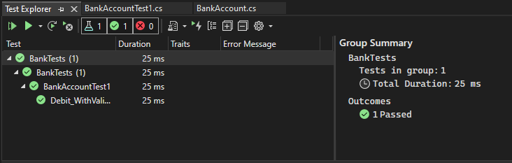

12. Использование модульных тестов для улучшения кода. В этом разделе рассматривается, как последовательный процесс анализа, разработки модульных тестов и рефакторинга может помочь сделать рабочий код более надежным и эффективным.

13. Анализ проблем. Мы создали тестовый метод для подтверждения того, что допустимая сумма правильно вычитается в методе Debit. Теперь проверим, что метод создает исключение ArgumentOutOfRangeException, если сумма по дебету:

больше баланса или
меньше нуля. 

14. Создание и запуск новых методов теста. Создадим метод теста для проверки правильного поведения в случае, когда сумма по дебету меньше нуля:

```C#
[TestMethod]
public void Debit_WhenAmountIsLessThanZero_ShouldThrowArgumentOutOfRange()
{
    // Arrange
    double beginningBalance = 11.99;
    double debitAmount = -100.00;
    BankAccount account = new BankAccount("Mr. Bryan Walton", beginningBalance);

    // Act and assert
    Assert.ThrowsException<System.ArgumentOutOfRangeException>(() => account.Debit(debitAmount));
}
```

Мы используем метод ThrowsException для подтверждения правильности созданного исключения. Этот метод приводит к тому, что тест не будет пройден, если не возникнет исключения ArgumentOutOfRangeException. Если временно изменить тестируемый метод для вызова более общего исключения ApplicationException при значении суммы по дебету меньше нуля, то тест работает правильно — то есть завершается неудачно.

Чтобы проверить случай, когда размер списания превышает баланс, выполните следующие действия:

Создать новый метод теста с именем Debit_WhenAmountIsMoreThanBalance_ShouldThrowArgumentOutOfRange.

Скопировать тело метода из Debit_WhenAmountIsLessThanZero_ShouldThrowArgumentOutOfRange в новый метод.

Присвоить debitAmount значение, превышающее баланс.

Выполните два теста и убедитесь, что они пройдены.

15. Продолжение анализа. Тестируемый метод можно дополнительно улучшить. При такой реализации мы не можем знать, какое условие (amount > m_balance или amount < 0) приводят к исключению, возвращаемому в ходе теста. Нам просто известно, что ArgumentOutOfRangeException где-то возникает в методе. Было бы лучше знать, какое условие в BankAccount.Debit вызвало исключение (amount > m_balance или amount < 0), чтобы быть уверенными в том, что наш метод правильно проверяет свои аргументы.

Еще раз проанализировав тестируемый метод BankAccount.Debit, можно заметить, что оба условных оператора используют конструктор ArgumentOutOfRangeException, который просто получает имя аргумента в качестве параметра:

```C#
throw new ArgumentOutOfRangeException("amount");
```

Так выглядит конструктор, который можно использовать для сообщения более детальной информации: ArgumentOutOfRangeException(String, Object, String) включает имя аргумента, значения аргумента и определяемое пользователем сообщение. Мы можем выполнить рефакторинг тестируемого метода для использования данного конструктора. Более того, можно использовать открытые для общего доступа члены типа для указания ошибок.


16. Рефакторинг тестируемого кода. Сначала определим две константы для сообщений об ошибках в области видимости класса. Добавьте это в тестируемый класс (BankAccount):
    
```C#
public const string DebitAmountExceedsBalanceMessage = "Debit amount exceeds balance";
public const string DebitAmountLessThanZeroMessage = "Debit amount is less than zero";
```

Затем изменим два условных оператора в методе Debit:

```C#
if (amount > m_balance)
{
    throw new System.ArgumentOutOfRangeException("amount", amount, DebitAmountExceedsBalanceMessage);
}

if (amount < 0)
{
    throw new System.ArgumentOutOfRangeException("amount", amount, DebitAmountLessThanZeroMessage);
}
```

17. Рефакторинг тестовых методов. Выполните рефакторинг методов теста, удалив вызов Assert.ThrowsException. Заключите вызов Debit() в блок try/catch, перехватите конкретное ожидаемое исключение и проверьте соответствующее ему сообщение. Метод Microsoft.VisualStudio.TestTools.UnitTesting.StringAssert.Contains обеспечивает возможность сравнения двух строк.

В этом случае метод Debit_WhenAmountIsMoreThanBalance_ShouldThrowArgumentOutOfRange может выглядеть следующим образом:

```C#
[TestMethod]
public void Debit_WhenAmountIsMoreThanBalance_ShouldThrowArgumentOutOfRange()
{
    // Arrange
    double beginningBalance = 11.99;
    double debitAmount = 20.0;
    BankAccount account = new BankAccount("Mr. Bryan Walton", beginningBalance);

    // Act
    try
    {
        account.Debit(debitAmount);
    }
    catch (System.ArgumentOutOfRangeException e)
    {
        // Assert
        StringAssert.Contains(e.Message, BankAccount.DebitAmountExceedsBalanceMessage);
    }
}
```

18. Повторное тестирование, переписывание и анализ. Метод теста сейчас обрабатывает не все требуемые случаи. Если тестируемый метод Debit не смог выдать исключение ArgumentOutOfRangeException, когда значение debitAmount было больше остатка (или меньше нуля), метод теста выдает успешное прохождение. Это нехорошо, поскольку метод теста должен был завершиться с ошибкой в том случае, если исключение не создается.

Это является ошибкой в методе теста. Для решения этой проблемы добавим утверждение Assert.Fail в конце тестового метода для обработки случая, когда исключение не создается.

Однако повторный запуск теста показывает, что тест теперь оказывается непройденным при перехватывании верного исключения. Блок catch перехватывает исключение, но метод продолжает выполняться, и в нем происходит сбой на новом утверждении Assert.Fail. Чтобы разрешить эту проблему, добавим оператор return после StringAssert в блоке catch. Повторный запуск теста подтверждает, что проблема устранена. Окончательная версия метода Debit_WhenAmountIsMoreThanBalance_ShouldThrowArgumentOutOfRange выглядит следующим образом:

```C#
[TestMethod]
public void Debit_WhenAmountIsMoreThanBalance_ShouldThrowArgumentOutOfRange()
{
    // Arrange
    double beginningBalance = 11.99;
    double debitAmount = 20.0;
    BankAccount account = new BankAccount("Mr. Bryan Walton", beginningBalance);

    // Act
    try
    {
        account.Debit(debitAmount);
    }
    catch (System.ArgumentOutOfRangeException e)
    {
        // Assert
        StringAssert.Contains(e.Message, BankAccount.DebitAmountExceedsBalanceMessage);
        return;
    }

    Assert.Fail("The expected exception was not thrown.");
}
```

19. Заключение. Усовершенствования тестового кода привели к созданию более надежных и информативных методов теста. Но что более важно, в результате был также улучшен тестируемый код.


---
# Задачи и средства модульных тестов

Модульные тесты позволяют разработчикам и тест-инженерам быстро искать логические ошибки в методах классов для проектов на языках C#, Visual Basic и C++.

Средства модульных тестов включают:

- Обозреватель тестов—Вы можете запускать модульные тесты и просматривать их результаты с помощью обозревателя тестов. Вы можете использовать любые тестовые платформы, в том числе сторонние платформы, которые имеют адаптер для обозревателя тестов.
  
- Платформа модульного тестирования Майкрософт для управляемого кода—Платформа для тестирования Майкрософт для управляемого кода устанавливается с Visual Studio и предоставляет среду для тестирования кода в .NET.
  
- Microsoft Native Unit Test Framework— Microsoft Native Unit Test Framework для C ++ устанавливается как часть рабочей нагрузки Desktop development with C++ . Эта платформа обеспечивает тестирование машинного кода. Вдобавок включаются платформы Google Test, Boost.Test и CTest, а также сторонние адаптеры для дополнительных платформ тестирования
  
- Инструменты покрытия кода—Можно определить объем кода продукта, который покрывают модульные тесты, при помощи одной команды в обозревателе тестов.

- Платформа изоляции Microsoft Fakes—Границы изоляции Microsoft Fakes могут создать постановочные классы и методы для рабочего и системного кода .NET, которые создают зависимости в тестируемом коде. Путем реализации подставных делегатов для функции можно контролировать поведение и возвращаемые значения объекта зависимости.
  

Кроме того, в .NET можно использовать компонент IntelliTest, чтобы изучить код и создать тестовые данные и набор модульных тестов. Для каждого оператора в коде создаются входные данные теста, которые будут выполнять этот оператор. Анализ случая выполняется для каждой условной ветви в коде.

https://docs.microsoft.com/ru-ru/visualstudio/test/unit-test-your-code?view=vs-2022

---

# Выполнение модульных тестов с помощью обозревателя тестов

С помощью обозревателя тестов вы можете запускать модульные тесты из Visual Studio или сторонних проектов модульного тестирования. Кроме того, обозреватель тестов позволяет группировать тесты по категориям, фильтровать список тестов, а также создавать, сохранять и запускать списки воспроизведения тестов. Вы также можете использовать Test Explorer для отладки модульных тестов, а также в Visual Studio Enterprise, для анализа объема протестированного кода.

Тесты в обозревателе тестов можно выполнять из нескольких тестовых проектов в решении, а также из тестовых классов, которые входят в производственные проекты. Тестовые проекты могут использовать различные платформы модульного тестирования. При написании тестируемого кода для платформы .NET тестовый проект можно написать на любом языке, который также ориентирован на платформу .NET, независимо от языка целевого кода. Проекты машинного кода C/C++ необходимо тестировать с помощью платформы модульного тестирования C++.

## Сборка тестового проекта

Если вы еще не подготовили тестовый проект в решении Visual Studio, необходимо сначала создать его и выполнить его сборку.

Приступая к работе с модульным тестированием (.NET)
Написание модульных тестов для C/C++
Visual Studio включает платформу модульного тестирования Майкрософт для управляемого и машинного кода. Однако с помощью обозревателя тестов можно также запустить любую платформу модульного тестирования, в которой реализован адаптер обозревателя тестов. Дополнительные сведения об установке сторонних платформ модульного тестирования см. в разделе Установка платформ модульного тестирования сторонних поставщиков

## Выполнение тестов в обозревателе тестов

При построении проекта тестирования тесты появляются в Обозревателе тестов. Если обозреватель тестов не виден, выберите Тест в меню Visual Studio, Окна, затем Обозреватель тестов (или нажмите клавиши CTRL + E, T).


При запуске, записи и повторном запуске тестов результаты в обозревателе тестов отображаются в стандартных группах Проект, Пространство имен и Класс. Вы можете изменить способ группировки тестов обозревателем тестов.

Большую часть работы по поиску, организации и выполнению тестов можно выполнять из панели инструментов обозревателя тестов.


## Выполнить тесты

Можно выполнить все тесты в решении, все тесты в группе или выбранный набор тестов. Выполните одно из следующих действий.

- Чтобы выполнить все тесты в решении, выберите значок Выполнить все (или нажмите клавиши CTRL + R, V).
- Чтобы выполнить все тесты в группе по умолчанию, выберите значок Запуск, а затем группу в меню.
- Выберите отдельные тесты, которые требуется запустить, откройте контекстное меню для выбранного теста и щелкните Запустить выбранные тесты (или нажмите клавиши CTRL + R, T).
- Если отдельные тесты не имеют зависимостей, предотвращающих запуск этих тестов в любом порядке, включите параллельное тестирование в меню параметров на панели инструментов. Это может заметно сократить время, необходимое для выполнения всех тестов.
  
## Запуск тестов после каждой сборки

Чтобы запустить модульные тесты после каждой локальной сборки, на панели инструментов обозревателя тестов щелкните значок "Параметры" и выберите в меню пункт Выполнить тесты после сборки.

## Просматривать результаты тестов

При выполнении, написании и повторном запуске тестов обозреватель тестов отображает результаты в группах Неудачные тесты, Пройденные тесты, Пропущенные тесты и Не запущенные тесты. В области сведений в нижней или боковой части окна обозревателя тестов отображается сводка тестового запуска.

## Просмотр сведений о тесте

Для просмотра подробных сведений для отдельного теста выберите тест.


- Имя исходного файла и номер строки метода теста.
- Состояние теста.
- Время, затраченное на выполнение метода теста.

Если тест не пройден, в области сведений также отображается следующее:

- сообщение, возвращенное платформой модульного тестирования для теста;
- трассировка стека во время сбоя теста.
  
## Просмотр исходного кода метода теста

Чтобы вывести исходный код для метода теста в редакторе Visual Studio, выберите тест, а затем в контекстном меню щелкните Открыть тест (или нажмите клавишу F12).

## Группировка и фильтрация списка тестов

Обозреватель тестов позволяет группировать тесты в стандартные категории. Большинство платформ модульного тестирования, которые работают в обозревателе тестов, позволяют определить собственные категории и пары "категория — значение" для группировки тестов. Кроме того, список тестов можно фильтровать, сопоставляя строки со свойствами теста.

## Группирование тестов в списке тестов

Обозреватель тестов позволяет группировать тесты в иерархию. Иерархические группы по умолчанию: Проект, Пространство имен, а затем Класс. Чтобы изменить способ упорядочения тестов, нажмите кнопку Группировать покнопка "Группировать" в обозревателе тестов и выберите новые условия группировки.

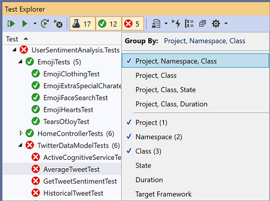

Вы можете определить собственные уровни иерархии и сгруппировать по состоянию, а затем классу, например, выбрав параметры "Группировать по" в порядке предпочтения.

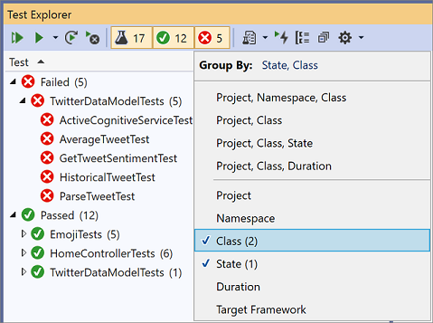

## Группы обозревателя тестов

Группа	Описание
Длительность	Группировка тестов по времени выполнения: Быстро, Средне и Медленно.
Состояние	Группировка тестов по результатами выполнения: Неудачные тесты, Пропущенные тесты, Пройденные тесты, Не выполнено.
Целевая рабочая среда	Группировка тестов по платформе цели их проекта.
Пространство имен	Группировка тестов по пространству имен, к которому они относятся.
Project	Группировка тестов по проекту, к которому они относятся.
Класс	Группировка тестов по классу, в который они входят.

## Признаки

Признак обычно представляет собой пару "имя — значение" категории, однако может быть и отдельной категорией. Признаки могут назначаться методам, которые идентифицируются платформой модульного тестирования как методы теста. Платформа модульного тестирования может определять категории признаков. Чтобы определить собственные пары "имя — значение" категории, можно добавлять значения в категории признаков. Синтаксис для указания категорий и значений признаков определяется платформой модульного тестирования.

### Создание настраиваемых списков воспроизведения

Вы можете создавать и сохранять список тестов, которые необходимо выполнять или просматривать как группу. Если выбрать список воспроизведения, тесты в списке отображаются на новой вкладке обозревателя тестов. Вы можете добавить тест в несколько списков воспроизведения.

Чтобы создать список воспроизведения, выберите один или несколько тестов в обозревателе тестов. В контекстном меню выберите Добавить в список воспроизведения > Новый список воспроизведения.

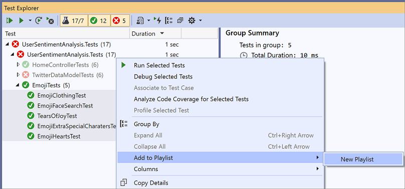

Список воспроизведения открывается на новой вкладке обозревателя тестов. Этот список воспроизведения можно использовать один раз, а затем удалить его. Вы также можете нажать кнопку Сохранить на панели инструментов окна списка воспроизведения, а затем выбрать имя и расположение, чтобы сохранить список.

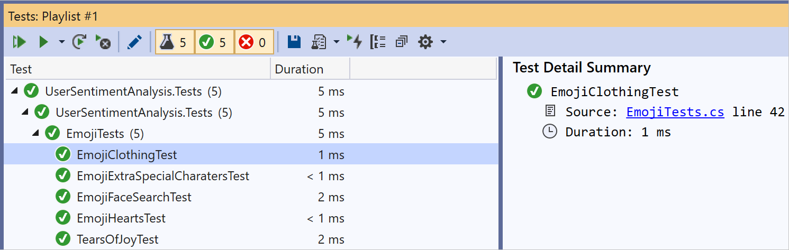

Чтобы создать список воспроизведения, выберите один или несколько тестов в обозревателе тестов. Щелкните правой кнопкой мыши и выберите Добавить в список воспроизведения > Новый список воспроизведения.d

Чтобы открыть список воспроизведения, выберите значок списка воспроизведения на панели инструментов Visual Studio и выберите в меню сохраненный ранее файл списка.

Чтобы изменить список воспроизведения, щелкните правой кнопкой мыши любой тест и воспользуйтесь пунктами меню для его добавления или удаления в списке.

Начиная с Visual Studio 2019 версии 16.7, кнопка Изменить доступна на панели инструментов. Рядом с тестами отобразятся флажки, которые показывают, какие тесты включены в список воспроизведения и исключены из него. Внесите необходимые изменения в группы.

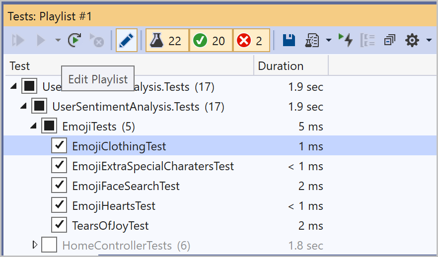

Вы также можете помечать флажком родительские группы в иерархии. Это делает список воспроизведения динамическим, и он будет постоянно обновляться в зависимости от тестов в той или иной группе. Например, если установить флажок напротив класса, то любой добавляемый из этого класса тест будет включаться в список. Если удалить тест из этого класса, он будет удален из списка воспроизведения. Чтобы получить дополнительные сведения о правилах, сохраните список воспроизведения с помощью кнопки "Сохранить" на панели инструментов и откройте файл .playlist, созданный на диске. В этом файле перечислены все правила и отдельные тесты, входящие в список воспроизведения.


```xml
<Playlist Version="2.0">
    <Rule Name="Includes" Match="Any">
        <Property Name="Trait" Value="SchemaUpdateBasic" />
    </Rule>
</Playlist>
```

Для xUnit используйте указанный ниже формат. Убедитесь в наличии пробела между вашим названием TestCategory и [Value].

```xml
<Playlist Version="2.0">
  <Rule Name="Includes" Match="Any">
    <Rule Match="All">
      <Property Name="Solution" />
        <Rule Match="Any">
            <Property Name="Trait" Value="TestCategory [Value]" />
        </Rule>
    </Rule>
  </Rule>
</Playlist>
```

# Столбцы обозревателя тестов

Группы также доступны в качестве столбцов в обозревателе тестов вместе с параметрами "Признак", "Трассировка стека", "Сообщение об ошибке" и "Полное имя". Большинство столбцов не отображаются по умолчанию. Вы можете настроить, какие столбцы отображаются и в каком порядке.

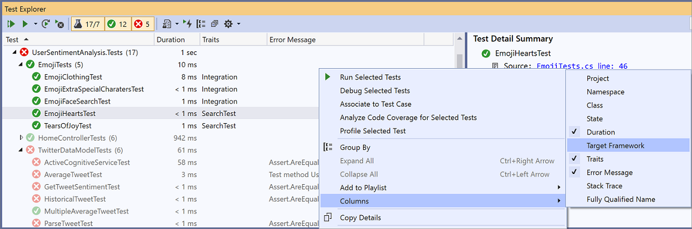


# Фильтрация, сортировка и изменение порядка столбцов теста

Можно отфильтровать, отсортировать столбцы и изменить их порядок.

- Чтобы выполнить фильтрацию по конкретным признакам, щелкните значок фильтра в верхней части столбца "Признаки".


- Чтобы изменить порядок столбцов, щелкните заголовок столбца и перетащите его влево или вправо.

- Чтобы отсортировать столбец, щелкните заголовок столбца. Не все столбцы можно отсортировать. Можно также выполнить сортировку по дополнительному столбцу, удерживая клавишу SHIFT и щелкнув дополнительный заголовок столбца.

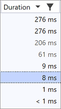

# Поиск и фильтрация списка тестов

Фильтры поиска обозревателя тестов можно также использовать для ограничения методов теста в проектах, которые вы просматриваете и запускаете.

Когда вы вводите строку в поле поиска обозревателя тестов и нажимаете клавишу ВВОД, список тестов фильтруется для отображения только тех тестов, полные имена которых содержат эту строку.

Фильтрация по различным условиям

1. Откройте раскрывающийся список справа от поля поиска.

2. Выберите новое условие.

3. Введите значение фильтра в кавычках. Если требуется найти точное совпадение в строке вместо совпадения, содержащего в себе текст, используйте знак равенства (=) вместо двоеточия (:).

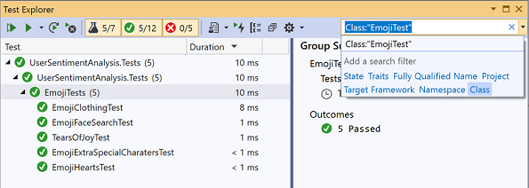


# Анализ покрытия кода модульного теста

Можно определить количество кода продукта, который действительно был проверен модульным тестированием, при помощи средства покрытия кода Visual Studio, доступного в выпуске Visual Studio Enterprise. Можно запустить покрытие кода на выбранных тестах или на всех тестах решения.

Для запуска покрытия кода для методов теста в решении

- Щелкните правой кнопкой мыши в обозревателе тестов и выберите Анализ покрытия кода для выбранных тестов.

Окно результатов объема протестированного кода отображает процент блоков кода продукта, которые были задействованы по строке, функции, классу, пространству имен и модулю.

Дополнительные сведения см. в статье Использование параметра объема протестированного кода для определения объема протестированного кода.


---

# Пошаговое руководство. Разработка на основе тестирования с помощью обозревателя тестов

Создавайте модульные тесты, чтобы обеспечить правильную работу кода с помощью добавочных изменений кода. Существует несколько платформ, которые можно использовать для написания модульных тестов, в том числе разработанные третьими сторонами. Некоторые тестовые среды специализируются на тестировании на различных языках или платформах. Обозреватель тестов предоставляет единый интерфейс модульных тестов для любых таких платформ. Дополнительные сведения об использовании обозревателя тестов см. в разделе Выполнение модульных тестов с помощью обозревателя тестов и Вопросы и ответы по обозревателю тестов.

В данном пошаговом руководстве показано, как разработать тестируемый метод в C# с помощью платформы тестирования Microsoft (MSTest). Можно легко адаптировать его для других языков или других тестовых платформ, например NUnit. Дополнительные сведения см. в разделе Установка платформ модульного тестирования сторонних поставщиков.

## Создание теста и создание кода

1. Создайте проекта C# Библиотека классов (.NET Standard). Данный проект будет содержать код, который мы хотим протестировать. Назовите проект MyMath.

2. В том же решении добавьте новый тестовый проект MSTest.

Начиная с Visual Studio 2019 версии 16.9, название шаблона проекта MSTest изменено с Проект тестов MSTest (.NET Core) на Проект модульного теста.

Назовите тестовый проект MathTests.
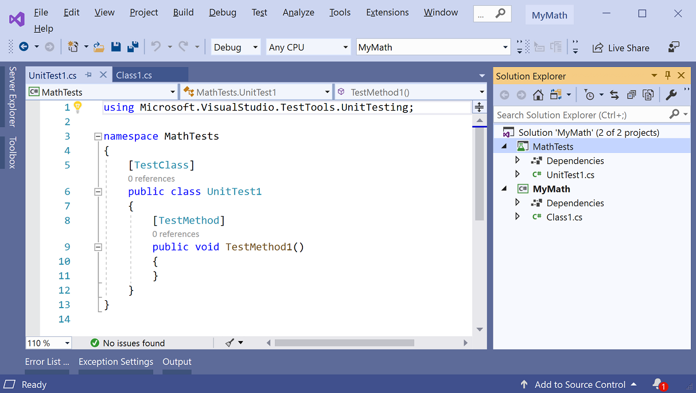

3. Напишите простой метод теста, который проверяет результат, полученный для конкретных входных данных. Добавьте в класс UnitTest1 приведенный ниже код.

```C#
[TestMethod]
public void BasicRooterTest()
{
  // Create an instance to test:
  Rooter rooter = new Rooter();
  // Define a test input and output value:
  double expectedResult = 2.0;
  double input = expectedResult * expectedResult;
  // Run the method under test:
  double actualResult = rooter.SquareRoot(input);
  // Verify the result:
  Assert.AreEqual(expectedResult, actualResult, delta: expectedResult / 100);
}
```

4. Создайте тип на основе кода теста.
   
   a. Установите курсор на Rooter, а затем в меню лампочки выберите Создать тип "Rooter" > Создать новый тип.

    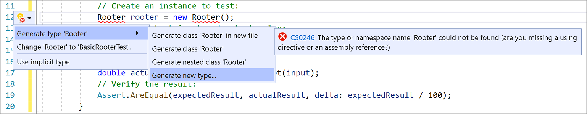

    b. В диалоговом окне Создать тип установите для параметра Проект значение MyMath, проект библиотеки классов, и нажмите OK.

    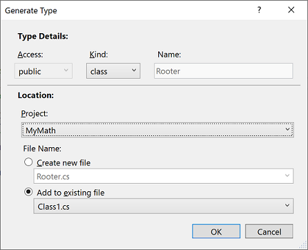

5. Создайте метод из кода теста. Установите курсор на SquareRoot, а затем в меню лампочки выберите Создать метод Rooter.SquareRoot.
6. Выполните модульный тест.
   a. Чтобы открыть Обозреватель тестов, в меню Тест выберите Windows > Обозреватель тестов.
   b. В обозревателе тестов выберите Запустить все, чтобы запустить тест.
   Выполняется сборка решения, тест запускается и завершается ошибкой.
7. Выберите имя теста.
   Дополнительные сведения о тесте появятся на панели Сводка теста.
   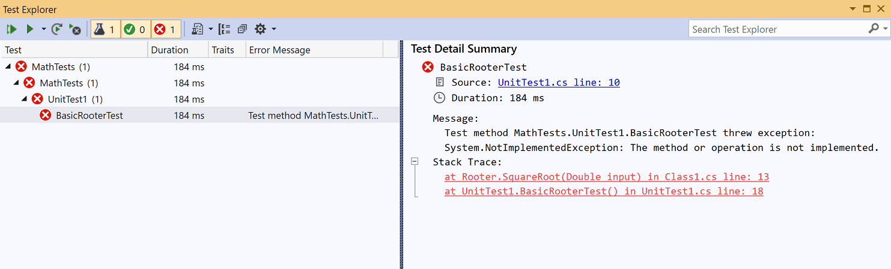
8. Перейдите по верхней ссылке в разделе Трассировка стека, чтобы перейти к расположению, в котором произошел сбой теста.
   
На данном этапе создан тест и заглушка, которые будут изменены таким образом, что тест будет успешно пройден.

## Проверка изменения кода
1. В файле Class1.cs улучшите код SquareRoot:

```C#
public double SquareRoot(double input)
{
    return input / 2;
}
```

2. В обозревателе тестов выберите Запустить все.
   Выполняется сборка решения, тест запускается и завершается успешно.
   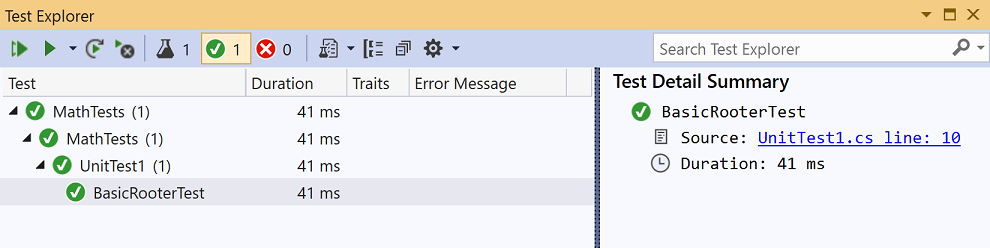

## Расширение диапазона входных данных

Для уверенности, что код работает во всех случаях, добавьте тесты, которые используют более широкий диапазон входных значений.

 Совет

Избегайте изменения существующих успешно выполненных тестов. Вместо этого добавьте новые тесты. Изменяйте существующие тесты только в тех случаях, когда меняются пользовательские требования. Такой подход позволяет не потерять существующие функциональные возможности при работе с расширенным кодом.

1. В тестовом классе добавьте следующий тест, который использует диапазон входных значений:

```C#
[TestMethod]
public void RooterValueRange()
{
    // Create an instance to test.
    Rooter rooter = new Rooter();

    // Try a range of values.
    for (double expected = 1e-8; expected < 1e+8; expected *= 3.2)
    {
        RooterOneValue(rooter, expected);
    }
}

private void RooterOneValue(Rooter rooter, double expectedResult)
{
    double input = expectedResult * expectedResult;
    double actualResult = rooter.SquareRoot(input);
    Assert.AreEqual(expectedResult, actualResult, delta: expectedResult / 1000);
}
```

2. В обозревателе тестов выберите Запустить все.

Новый тест завершается неудачей (несмотря на то, что первый тест по-прежнему завершается успешно). Чтобы найти точку сбоя, выберите тест, который не пройден, и просмотрите сведения на панели Сводка теста.

3. Проверьте тестируемый метод, чтобы узнать, что не так. Измените код SquareRoot, как показано:

```C#
public double SquareRoot(double input)
{
  double result = input;
  double previousResult = -input;
  while (Math.Abs(previousResult - result) > result / 1000)
  {
    previousResult = result;
    result = result - (result * result - input) / (2 * result);
  }
  return result;
}
```

4. В обозревателе тестов выберите Запустить все.

    Теперь оба теста завершаются успешно.

## Добавление тестов для исключительных случаев

1. Добавьте новый тест для отрицательных входных значений:
   
```C#
[TestMethod]
public void RooterTestNegativeInputx()
{
    Rooter rooter = new Rooter();
    try
    {
        rooter.SquareRoot(-10);
    }
    catch (System.ArgumentOutOfRangeException)
    {
        return;
    }
    Assert.Fail();
}
```

2. В обозревателе тестов выберите Запустить все.
   Тестируемый метод зацикливается, его необходимо отменить вручную.

3. На панели инструментов обозревателя тестов нажмите Отмена.
   Выполнение теста останавливается.

4. Исправьте код SquareRoot, добавив следующую инструкцию if в начало метода:

```C#
public double SquareRoot(double input)
{
    if (input <= 0.0)
    {
        throw new ArgumentOutOfRangeException();
    }
```
5. В обозревателе тестов выберите Запустить все.
   Все тесты завершаются успешно.

## Рефакторинг тестируемого кода

Выполните рефакторинг кода, но не изменяйте тесты.

 Совет

Рефакторинг — это изменение, которое делает код более производительным или более понятным. Это действие не предназначено для изменения поведения кода, поэтому тесты не изменяются.

Рекомендуется выполнять рефакторинг отдельно от расширения функциональности. Неизменяемость тестов уменьшает шансы случайных ошибок во время рефакторинга.

1. Измените строку, которая вычисляет result в методе SquareRoot, следующим образом:

```C#

public double SquareRoot(double input)
{
    if (input <= 0.0)
    {
        throw new ArgumentOutOfRangeException();
    }

    double result = input;
    double previousResult = -input;
    while (Math.Abs(previousResult - result) > result / 1000)
    {
        previousResult = result;
        result = (result + input / result) / 2;
        //was: result = result - (result * result - input) / (2*result);
    }
    return result;
}

```

2. Выберите Выполнить все и убедитесь, что все тесты по-прежнему завершаются успехом.
   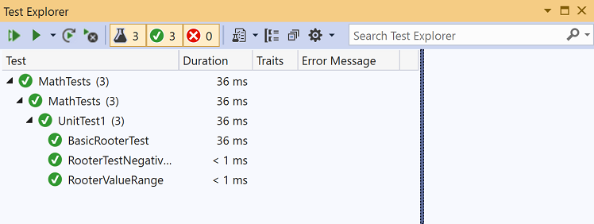

---

### Основные сведения о модульных тестах

Убедитесь, что код работает, как ожидалось, создав и выполнив модульные тесты. Модульное тестирование получило такое название, так как функции программы разбиваются на отдельные тестируемые участки поведения, которые можно протестировать в качестве отдельных модулей. Обозреватель тестов Visual Studio предоставляет гибкий и эффективный способ запуска модульных тестов и просмотра результатов в Visual Studio. Visual Studio устанавливает платформы модульного тестирования Microsoft для управляемого и машинного кода. Платформа модульного тестирования используется для создания модульных тестов, их запуска и создания отчетов о результатах таких тестов. Завершив внесение изменений, запустите модульные тесты повторно, чтобы убедиться, что код по-прежнему работает правильно. Visual Studio Enterprise может выполнять эту задачу автоматически с помощью функции Live Unit Testing, которая определяет тесты, затронутые вносимыми в код изменениями, и выполняет их в фоновом режиме в процессе ввода.

Модульное тестирование максимально влияет на качество кода, когда оно является неотъемлемой частью рабочего процесса разработки ПО. После написания функции или другого блока кода приложения создаются модульные тесты, которые проверяют поведение кода в ответ на стандартные, граничные и некорректные случаи ввода данных; также проверяются любые явные или предполагаемые допущения, сделанные кодом. При разработке, управляемой тестами, модульные тесты создаются перед написанием кода, поэтому модульные тесты используются в качестве технической документации и спецификации функциональности.

Обозреватель тестов также может запускать тесты c платформ модульных тестов стороннего производителя и платформ на основе открытого кода, имеющих дополнительные интерфейсы для Обозревателя тестов. Многие из этих платформ могут быть добавлены при помощи Менеджера расширений Visual Studio и Галереи Visual Studio. Дополнительные сведения см. в разделе Установка платформ модульного тестирования сторонних поставщиков.

Можно быстро создавать тестовые проекты и методы теста из кода или создавать тесты вручную при необходимости. При использовании компонента IntelliTest для изучения кода .NET можно создавать тестовые данные и наборы модульных тестов. Для каждого оператора в коде создаются входные данные теста, которые будут выполнять этот оператор. Узнайте, как создавать модульные тесты для кода .NET.

### Пример решения MyBank

В этой статье в качестве примера используется разработка ненастоящего приложения, которое называется MyBank. Чтобы следовать разъяснениям в данном разделе, действительного кодирования не потребуется. Методы тестирования написаны на C# и представлены при помощи платформы модульного тестирования Microsoft для управляемого кода. Но эти принципы применимы и к другим языкам и платформам.

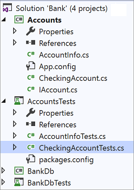

Первая попытка проектирования приложения MyBank включает в себя компонент счетов, который представляет собой лицевой счет и его транзакции с банком, а также компонент базы данных, который включает в себя функции объединения лицевых счетов и управления ими.

Создается решение MyBank , которое содержит два проекта.

- Accounts

- BankDb

Первая попытка создания проекта Accounts содержит класс для хранения базовой информации о счете, интерфейс, который определяет функции счета любого типа, например, для внесения и снятия средств со счета и класс, производный от интерфейса, который представляет собой текущий счет. Проект Счета начинается с создания следующих исходных файлов:

- AccountInfo.cs, который определяет основную информацию о счете;
- IAccount.cs, определяющего стандартный интерфейс IAccount для счета, включая методы внесения и снятия средств со счета и получения баланса счета;
- CheckingAccount.cs, содержащего класс CheckingAccount, который реализует интерфейс IAccount для чекового счета.
  
Из опыта известно, что при снятии средств с текущего счета необходимо убедиться, что количество снимаемых средств меньше, чем размер баланса счета. Поэтому метод IAccount.Withdraw в CheckingAccount перекрывается методом, который проверяет данное условие. Метод может выглядеть следующим образом.

```C#
public void Withdraw(double amount)
{
    if(m_balance >= amount)
    {
        m_balance -= amount;
    }
    else
    {
        throw new ArgumentException(nameof(amount), "Withdrawal exceeds balance!");
    }
}
```

Теперь, когда есть немного кода, можно провести тестирование.

## Создание проектов модульных тестов и методов тестирования (C#)

Для C# как правило, проще создать проект модульного теста и заглушки модульных тестов из кода. Кроме того, можно создать проект модульных тестов и тесты вручную в зависимости от потребностей. Если вы хотите создавать модульные тесты из кода на сторонней платформе, вам потребуется установить одно из этих расширений: NUnit или xUnit. Если вы не используете C#, пропустите этот раздел и перейдите к разделу Создание проекта и модульных тестов вручную.

## Создание проекта модульного теста и заглушек модульных тестов

1. В окне редактора кода выберите в контекстном меню команду Создать модульные тесты.
   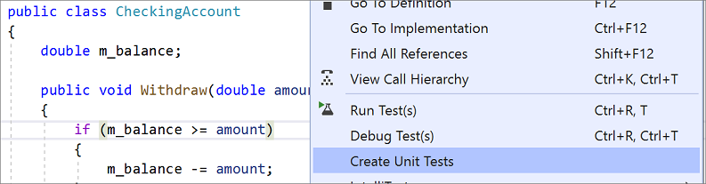

2. Нажмите кнопку ОК, чтобы принять значения по умолчанию для создания модульных тестов, или измените значения, которые использовались для создания и назначения имени проекта модульного теста и модульных тестов. Можно выбрать код, который добавляется по умолчанию в методы модульных тестов.


3. Заглушки модульных тестов создаются в новом проекте модульного теста для всех методов в классе.

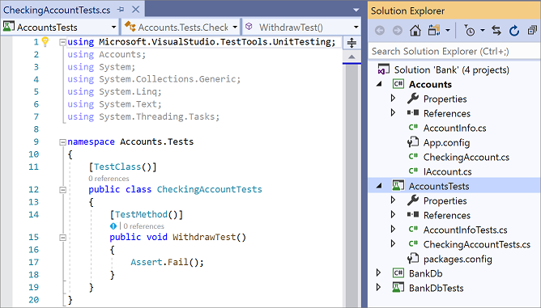

4. Теперь рассмотрим процедуру Написания тестов, чтобы сделать ваш модульный тест значимым, а также любого рода дополнительные модульные тесты, которые вы, возможно, захотите добавить с целью тщательного тестирования вашего кода.
   

## Создание проекта и модульных тестов вручную

Проект модульного теста отражает структуру проекта кода. В примере MyBank добавляются два проекта модульного тестирования с именами AccountsTests и BankDbTests в решение MyBanks . Имена проекта теста произвольны, но рекомендуется принять концепцию стандартного именования.

Добавление нового проекта модульного тестирование в решение

1. В обозревателе решений щелкните решение правой кнопкой мыши и выберите Добавить > Создать Проект.
2. Введите test в поле поиска шаблона проекта, чтобы найти шаблон проекта модульного теста для платформы тестирования, которую вы хотите использовать. (В примерах этого раздела мы используем MSTest.)
3. На следующей странице присвойте проекту имя. Для тестирования проекта Accounts в нашем примере проект можно назвать AccountsTests.
4. В проекте модульного тестирования добавьте ссылку на проект кода в тесте, а в данном примере — на проект Счета.
   
   Создание ссылки на проект кода
   a. В проекте модульного теста в обозревателе решений щелкните правой кнопкой мыши узел Ссылки или Зависимости, после чего выберите Добавить ссылку на проект или Добавить ссылку, в зависимости от того, что доступно.
   b. В диалоговом окне диспетчера ссылок откройте узел Решение и выберите Проекты. Выберите наименование проекта кода и закройте диалоговое окно.

Каждый проект модульного тестирования содержит классы, которые отражают имена классов в проекте кода. В данном примере проект AccountsTests будет содержать следующие классы.

- КлассAccountInfoTests содержит методы модульного тестирования для класса AccountInfo в проекте Accounts .
- КлассCheckingAccountTests содержит методы модульного тестирования для класса CheckingAccount .

## Написание тестов

Платформа модульного тестирования и Visual Studio IntelliSense помогут вам в написании кода модульных тестов для проекта кода. Для запуска в обозревателе тестов многие платформы требуют добавления особых атрибутов для определения методов модульного тестирования. Платформы также предоставляют способ — обычно при помощи оператора контроля или атрибутов метода -— для определения успешности или не успешности теста. Другие атрибуты определяют необязательные методы установки, которые выполняются при инициализации класса и перед каждым методом тестирования, а также методы разборки, которые запускаются после каждого метода тестирования и после уничтожения класса.

Модель AAA (размещение, действие, утверждение) является стандартным способом написания модульных тестов для метода тестирования.

- Подраздел Размещение метода модульного тестирования инициализирует объекты и устанавливает значение данных, которые переданы методу для теста.
- Подраздел Действие вызывает метод для теста с размещенными параметрами.
  

Чтобы протестировать метод CheckingAccount.Withdraw в контексте нашего примера, мы можем написать два теста: один, проверяющий стандартное поведение метода, и второй, проверяющий, что снятие суммы, превышающей остаток, не удастся (в нижеприведенном коде показан модульный тест MSTest, который поддерживается в .NET.). В классе CheckingAccountTests добавьте следующие методы.

```C#
[TestMethod]
public void Withdraw_ValidAmount_ChangesBalance()
{
    // arrange
    double currentBalance = 10.0;
    double withdrawal = 1.0;
    double expected = 9.0;
    var account = new CheckingAccount("JohnDoe", currentBalance);

    // act
    account.Withdraw(withdrawal);

    // assert
    Assert.AreEqual(expected, account.Balance);
}

[TestMethod]
public void Withdraw_AmountMoreThanBalance_Throws()
{
    // arrange
    var account = new CheckingAccount("John Doe", 10.0);

    // act and assert
    Assert.ThrowsException<System.ArgumentException>(() => account.Withdraw(20.0));
}
```
## Настройка времени ожидания для модульных тестов

Если вы используете платформу MSTest, можно использовать TimeoutAttribute для установки времени ожидания в отдельном методе теста:

```C#
[TestMethod]
[Timeout(2000)]  // Milliseconds
public void My_Test()
{ ...
}

```

Задние лимита времени на максимально разрешенный

```C#
[TestMethod]
[Timeout(TestTimeout.Infinite)]  // Milliseconds
public void My_Test ()
{ ...
}
```

## Выполнение тестов в обозревателе тестов

При построении проекта тестирования тесты появляются в обозревателе тестов. Если обозреватель тестов не виден, выберите Тест в меню Visual Studio, Windows, затем обозреватель тестов (или нажмите клавиши CTRL + E, T).

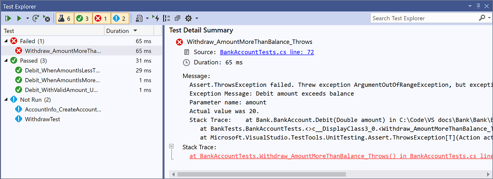

При выполнении, написании и повторном запуске тестов обозреватель тестов может отображать результаты в группах Неудачные тесты, Пройденные тесты, Пропущенные тесты и Незапущенные тесты. Можно выбирать различные группы по параметрам на панели инструментов.

Кроме того, можно фильтровать тесты по совпадению текста в поле поиска на глобальном уровне или с помощью одного из предустановленных фильтров. Можно запустить любую выборку тестов в любое время. Результаты запущенного теста появляются сразу же в строке "успешно/не успешно" наверху окна обозревателя. Детальная информация результата метода тестирования отображается при выборе теста.

Выполнение и просмотр тестов

Панель инструментов обозревателя тестов помогает найти, организовать и запустить необходимые тесты.
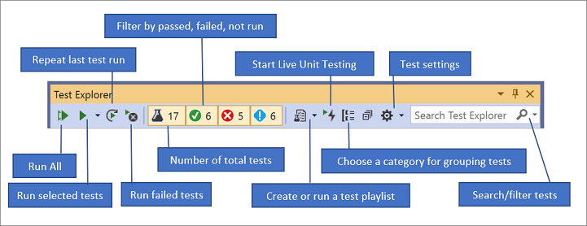

Можно выбрать Запустить все, чтобы запустить все тесты (или нажать клавиши CTRL + R, V), или выбрать Запустить, чтобы выбрать подмножество тестов для запуска (или нажать клавиши CTRL + R, T). Выберите тест, чтобы просмотреть детальную информацию по нему на панели сведений. Выберите Открыть текст в контекстном меню (клавиша F12) для отображения исходного кода выбранного теста.

Если отдельные тесты не имеют зависимостей, предотвращающих запуск этих тестов в любом порядке, включите параллельное тестирование в меню параметров на панели инструментов. Это может заметно сократить время, необходимое для выполнения всех тестов.


## Запуск тестов после каждой сборки

Чтобы запустить модульные тесты после каждой локальной сборки, на панели инструментов обозревателя тестов щелкните значок "Параметры" и выберите в меню пункт Выполнить тесты после сборки.

## Фильтрация и группировка списка тестов

Если тестов много, можно отфильтровать список по определенной строке. Для этого введите соответствующий текст в поле поиска обозревателя тестов. Можно ограничить фильтр при помощи выбора фильтров из списка.


---

# Создание заглушек методов для модульных тестов с помощью кода

Команда Создать модульные тесты создает заглушки метода модульных тестов. Эта функция упрощает настройку тестового проекта, тестового класса и заглушки тестового метода в нем.

Команда меню Создать модульные тесты является расширяемой и может использоваться для создания тестов для MSTest, MSTest V2, NUnit и xUnit.

## Начало работы

Чтобы приступить к работе, выберите метод, тип или пространство имен в редакторе кода в проекте, которые нужно протестировать, щелкните правой кнопкой мыши и выберите Создать модульные тесты. Откроется диалоговое окно Создать модульные тесты, где можно настроить способ создания тестов.

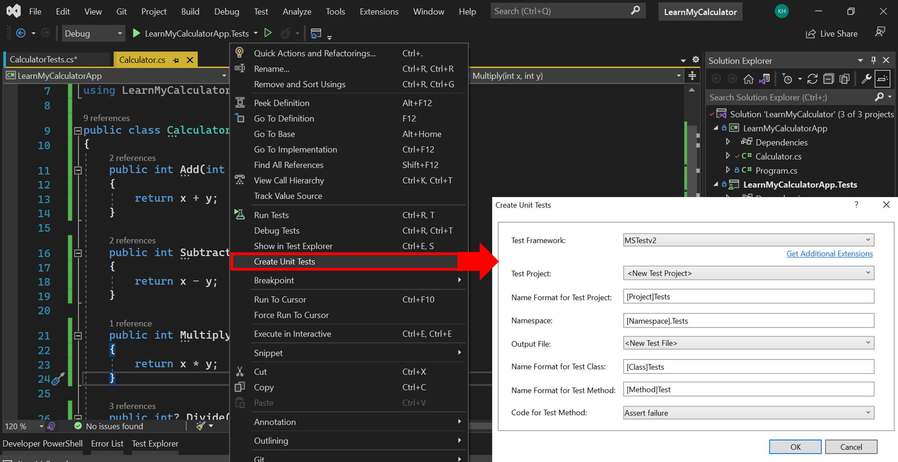

## Настройка признаков модульных тестов

Если вы планируете выполнять эти тесты в рамках процесса автоматизации тестирования, может потребоваться создать тест в другом тестовом проекте (второй параметр в указанном выше диалоговом окне) и настроить признаки для модульного теста. Это упростит включение или исключение этих тестов в рамках конвейера непрерывного развертывания или непрерывной интеграции. Признаки задаются за счет добавления метаданных напрямую в модульный тест, как показано ниже.

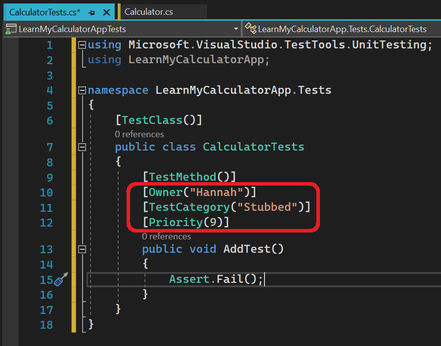

## Когда следует использовать эту функцию?

Используйте эту функцию, когда нужно создать модульные тесты, в частности, когда вы тестируете существующий код с крайне небольшим или отсутствующим объемом протестированного кода и отсутствующей документацией. Другими словами, в ситуациях, когда спецификация кода отсутствует или ограничена. Она эффективно реализует подход, аналогичный IntelliTest, при котором характеризуется наблюдаемое поведение кода.

Однако эта функция также применима и для ситуаций, когда разработчик сначала пишет код, а затем использует его для начальной загрузки модульных тестов. В рамках потока написания кода разработчику может потребоваться быстро создать заглушку для метода модульного тестирования (с подходящим тестовым классом и тестовым проектом) для определенного фрагмента кода.

---

# Практическое руководство. создание модульного теста, управляемого данными

Вы можете использовать платформу модульного тестирования Майкрософт для управляемого кода, чтобы настроить метод модульного теста для получения значений из источника данных. Этот метод последовательно выполняется для каждой строки в источнике данных, что облегчает тестирование разнообразных входных данных с помощью одного метода.

Создание управляемого данными модульного теста включает в себя указанные ниже шаги.

1. Создайте источник данных, в котором содержатся значения, используемые в методе теста. Источник данных может быть любого типа, который зарегистрирован на компьютере, где выполняется тест.
2. Добавьте частное поле TestContext и общее свойство TestContext в тестовый класс.
3. Создайте метод модульного теста и добавьте к нему атрибут DataSourceAttribute.
4. Используйте свойство индексатора DataRow для получения значений, используемых в тесте.

## Тестируемый метод

Например, допустим, что у вас есть:

1. решение с именем MyBank, которое принимает и обрабатывает транзакции для различных типов счетов;
2. проект в MyBank с именем BankDb, который управляет транзакциями для счетов;
3. класс с именем Maths в проекте BankDb, выполняющий математические функции, позволяющие убедиться в том, что любая транзакция выгодна банку;
4. проект модульного теста с именем BankDbTests для тестирования функциональности компонента BankDb;
5. класс модульного теста с именем MathsTests для проверки функциональности класса Maths.

Мы проверяем метод в Maths, который складывает два целых числа с помощью цикла:

```C#
public int AddIntegers(int first, int second)
{
    int sum = first;
    for( int i = 0; i < second; i++)
    {
        sum += 1;
    }
    return sum;
}
```

## Создание источника данных

Чтобы проверить метод AddIntegers, создайте источник данных, определяющий диапазон значений для параметров и ожидаемую возвращаемую сумму. В этом примере мы создадим базу данных SQL Compact с именем MathsData и таблицу с именем AddIntegersData, которая содержит следующие имена столбцов и значения:


| FirstNumber      | SecondNumber                |SUM|
| ------------- |:------------------|----------------|
| 0 | 1 | 1 |
| 1 | 1 | 2 |
| 2 | -3 | -1 |

## Добавление TestContext в тестовый класс

Платформа модульного тестирования создает объект TestContext для хранения информации из источника данных для теста, управляемого данными. Затем платформа присваивает этому объекту значение создаваемого свойства TestContext.

```C#
private TestContext testContextInstance;
public TestContext TestContext
{
    get { return testContextInstance; }
    set { testContextInstance = value; }
}
```


В методе теста получить доступ к данным можно через свойство индексатора DataRow``TestContext.

Примечание

.NET Core не поддерживает атрибут DataSource. При попытке получить доступ к данным тестирования таким образом в проекте модульного теста для .NET Core или универсальной платформы Windows вы увидите сообщение об ошибке "'TestContext' не содержит определение для 'DataRow', и доступный метод расширения 'DataRow', принимающий первый аргумент типа 'TestContext', не найден (возможно, отсутствует директива using или ссылка на сборку?)".

## Написание метода теста

Метод теста для AddIntegers достаточно прост. Для каждой строки в источнике данных вызовите AddIntegers со значениями столбцов FirstNumber и SecondNumber в качестве параметров и сверьте возвращаемое значение со значением столбца Sum:

```C#
[DataSource(@"Provider=Microsoft.SqlServerCe.Client.4.0; Data Source=C:\Data\MathsData.sdf;", "Numbers")]
[TestMethod()]
public void AddIntegers_FromDataSourceTest()
{
    var target = new Maths();

    // Access the data
    int x = Convert.ToInt32(TestContext.DataRow["FirstNumber"]);
    int y = Convert.ToInt32(TestContext.DataRow["SecondNumber"]);
    int expected = Convert.ToInt32(TestContext.DataRow["Sum"]);
    int actual = target.IntegerMethod(x, y);
    Assert.AreEqual(expected, actual,
        "x:<{0}> y:<{1}>",
        new object[] {x, y});
}
```

Метод Assert содержит сообщение, которое отображает значения x и y итерации, в которой произошел сбой. По умолчанию утвержденные значения expected и actual уже содержатся в сведениях неудачного теста.


## Определение DataSourceAttribute

Атрибут DataSource задает строку подключения для источника данных и имя таблицы, которая используется в методе теста. Точные сведения в строке подключения отличаются в зависимости от типа используемого источника данных. В этом примере используется база данных SqlServerCe.

```C#
[DataSource(@"Provider=Microsoft.SqlServerCe.Client.4.0;Data Source=C:\Data\MathsData.sdf", "AddIntegersData")]
```

Атрибут DataSource имеет три конструктора.

```C#
[DataSource(dataSourceSettingName)]
```

Конструктор с одним параметром использует информацию о подключении, хранящуюся в файле app.config решения. В файле конфигурации XML-элемент с именем dataSourceSettingsName содержит в себе информацию о подключении.

Использование файла app.config позволяет менять расположение источника данных и при этом не вносить изменения в сам модульный тест. 

```C#
[DataSource(connectionString, tableName)]
```

Конструктор DataSource с двумя параметрами задает строку подключения к источнику данных и имя таблицы, содержащей данные для метода теста.

Строки подключения зависят от типа источника данных, но они должны содержать элемент Provider, который определяет неизменяемое имя поставщика данных.

```C#
[DataSource(
    dataProvider,
    connectionString,
    tableName,
    dataAccessMethod
    )]
```

## Использование TestContext.DataRow для доступа к данным


Для доступа к данным в таблице AddIntegersData используйте индексатор TestContext.DataRow. DataRow является объектом DataRow, поэтому значения столбца извлекаются по индексу или имени столбца. Так как значения возвращаются в виде объектов, преобразуйте их в соответствующий тип.

```C#
int x = Convert.ToInt32(TestContext.DataRow["FirstNumber"]);
```

## Запуск теста и просмотр результатов

Завершив написание метода теста, выполните сборку тестового проекта. Метод теста приводится в обозревателе тестов в группе Не запускавшиеся тесты. При запуске, написании и повторном запуске тестов в обозревателе тестов результаты отображаются в группах Неудачные тесты, Пройденные тесты и Незапускавшиеся тесты. Можно выбрать Запустить все , чтобы запустить все тесты, или выбрать Запустить , чтобы выбрать подмножество тестов для запуска.


---
**Примечание**

Панель результатов теста в верхней части обозревателя тестов обновляется по мере выполнения тестов. По завершении тестового запуска область становится зеленой, если все тесты пройдены, или красной, если какой-либо из тестов не был пройден успешно. Сводка тестового запуска приводится в области сведений в нижней части окна обозревателя тестов. Выберите тест, чтобы просмотреть детальную информацию по данному тесту в нижней панели.


При выполнении метода AddIntegers_FromDataSourceTest в нашем примере панель результатов станет красной, а метод теста переместится в группу Неудачные тесты. Тест, управляемый данными, завершается с ошибкой, если какая-либо итерация из источника данных завершается неудачно. При выборе неудачных тестов, управляемых данными, в окне обозревателя тестов на панели сведений выводятся результаты каждой итерации в соответствии с индексом строки данных. В этом примере оказывается, что алгоритм AddIntegers неправильно обрабатывает отрицательные значения.

После исправления тестируемого метода и повторного выполнения теста панель результатов станет зеленой и метод теста переместится в группу Пройденные тесты.
