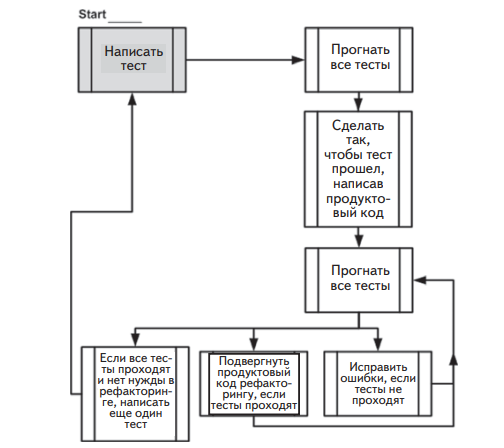

# Практическая работа 2. Разработка через тестирование. TDD.

Итак, мы знаем, как писать структурированные, пригодные для сопровождения и заслуживающие доверия тесты с помощью каркаса автономного тестирования. Теперь возникает следующий вопрос: когда
это делать. Многие считают, что лучшее время для написания автономных тестов – по окончании разработки программы, однако растет
число тех, кто предпочитает писать тесты до создания продуктового
кода. Такой подход получил название «тесты сначала» или «разработка через тестирование» (test-driven development – TDD).

Примечание. Существуют разные точки зрения на точный смысл разработки через тестирование. Одни говорят, что все дело в написании тестов
сначала, другие – что в большом количестве тестов. Кто-то считает, что это
способ проектирования, а кто-то – что таким образом можно было бы определять поведение программы, уделяя собственно проектированию гораздо меньше внимания. Здесь под TDD
будет пониматься процесс разработки, при котором тесты пишутся сначала,
а проектирование играет вторичную роль (и обсуждаться не будет).

На рис. 1 Традиционный способ написания автономных тестов.
Пунктирными линиями представлены действия,
которые принято считать необязательными
 

TDD отличается от традиционной разработки, как показывает
рис. 2. Мы начинаем с теста, который не проходит. Затем переходим
к созданию продуктового кода, добиваясь, чтобы тест прошел, после
приступаем либо к рефакторингу кода, либо к созданию следующего
безуспешного теста

Разработка через тестирование – взгляд с высоты
птичьего полета. Обратите внимание на спиральный характер
процесса: написать тест, написать код, выполнить рефакторинг,
написать следующий тест. Это демонстрация инкрементной
природы TDD: мелкие шаги приводят к высококачественному
конечному результату

Эта книга посвящена технике написания хороших автономных тестов, а не разработке через тестирование, но я сам большой поклонник
TDD. Я написал несколько крупных приложений и каркасов с применением TDD, руководил командами, использующими TDD в работе, и провел более сотни курсов и семинаров по TDD и методикам
автономного тестирования. На собственном опыте я убедился, что
TDD помогает создавать высококачественный код и высококачественные тесты, причем структура кода оказывается лучше, чем раньше. Я убежден, что вы сможете применить эту методику с выгодой, но
за это придется заплатить (временем на изучение, внедрение и т. п.).
Впрочем, затраты окупятся сторицей.
Важно понимать, что TDD ничего не гарантирует: и проект может
провалиться, и тесты могут получиться нестабильными или непригодными для сопровождения. Очень легко поддаться обаянию самой
методики TDD и перестать обращать внимание на способ написания
автономных тестов: выбор имен, акцент на удобочитаемость и пригодность для сопровождения. Легко даже упустить из виду, то ли они
тестируют, что нужно, и не содержат ли ошибок. Вот потому-то я и
пишу эту книгу.
Методика TDD очень проста.

1. Написать тест, который не проходит, и тем самым доказать,
что в конечном продукте отсутствует некий код или функциональность. Тест пишется так, будто продуктовый код уже работает, поэтому отказ теста означает, что в продуктовом коде есть
ошибка. Если бы я хотел добавить в класс калькулятора функцию запоминания последней суммы LastSum, то написал бы
тест, проверяющий, что LastSum действительно содержит правильное значение. Этот тест не откомпилировался бы, поэтому
я добавил бы ровно столько кода, чтобы компиляция прошла
успешно (не реализуя запоминание числа), и снова прогнал бы
код. На этот раз он выполнился бы, но с ошибкой, потому что
функциональность еще не реализована.

2. Сделать так, чтобы тест прошел, написав продуктовый код,
отвечающий ожиданиям теста. Продуктовый код должен быть
максимально простым.

3. Подвергнуть его рефакторингу, т. е. переработать его. Добившись успешного завершения теста, мы вправе либо перейти к
следующему тесту, либо переработать код: сделать его более
удобочитаемым, устранить дублирование и т. д.

Заниматься рефакторингом можно после написания нескольких
тестов или после каждого теста. Это важный шаг, он повышает удобочитаемость и сопровождаемость кода, гарантируя, что все ранее написанные тесты проходят.

**Определение**. Под **рефакторингом** понимается изменение части кода без
изменения его функциональности. Переименование метода – это рефакторинг. Разбиение длинного метода на несколько более коротких – тоже рефакторинг. В обоих случаях программа делает то же, что и раньше, но ее становится проще сопровождать, читать, отлаживать и изменять.

Формулировка шагов TDD выглядит технической, но за ней стоит
обычная житейская мудрость. При правильном применении TDD качество кода устремится ввысь, количество ошибок уменьшится, ваша
уверенность в правильности программы повысится, время поиска
ошибок сократится, структура кода станет совершеннее, а начальник
будет доволен. Напротив, при неправильном применении TDD работа над проектом будет выбиваться из графика, время – тратиться
впустую, мотивация – ослабевать, а качество кода – снижаться. Это
палка о двух концах, и многие осознали это на собственной шкуре

Технически, одно из важнейших достоинств TDD, о котором вам
никто не расскажет, состоит в том, что, наблюдая, как тест падает,
а затем проходит, хотя вы ничего в нем самом не изменяли, вы по
сути дела тестируете сам тест. Если вы ожидаете, что тест не должен
пройти, а он проходит, то, вероятно, есть ошибка в самом тесте или
вы тестируете не то, что нужно. Если ранее падавший тест должен
пройти, но все равно не проходит, значит, либо в тесте ошибка, либо
вы не того ожидаете.

В этой книге речь пойдет об удобочитаемых, пригодных для сопровождения и заслуживающих доверия тестах, но наибольшую уверенность в своих тестах вы получаете, когда видите, как они падают и
проходят в должное время. TDD в этом очень помогает, и это одна из
причин, по которой разработчики, практикующие TDD, гораздо меньше занимаются отладкой, чем те, кто автономно тестирует свой код
постфактум. Если доверяешь тесту, то нет нужды отлаживать просто
«на всякий случай». А доверие возникает, когда видишь обе стороны
теста: ту, что падает, и ту, что проходит, – то и другое в свое время.

## Три основных навыка успешного практика TDD

Для успешной разработки через тестирование нужно обладать тремя
основными навыками: знать, как писать хорошие тесты, писать их
раньше кода и правильно структурировать тесты

- Из того, что вы пишете тесты сначала, еще не следует, что
они будут удобочитаемыми, пригодными для сопровождения
или заслуживающими доверия. Навыки написания хороших
автономных тестов – как раз то, о чем написана эта книга.

- Из того, что вы пишете удобочитаемые и пригодные для сопровождения тесты, еще не следует, что вы получите те же выгоды, что при написании их сначала. Умение писать тесты
сначала – это то, чему учат книги по TDD (по крайней мере,
большая их часть), хотя о навыках написания хороших тестов
в них нет ни слова. Особенно я рекомендовал бы книгу Kent
Beck «Test-Driven Development: by Example»1
 (Addison-Wesley
Professional, 2002).

- Из того, что вы пишете тесты сначала, и они являются
удобочитаемыми и пригодными для сопровождения, еще не
следует, что в итоге получится хорошо структурированная
система. Только навыки проектирования позволяют сделать
код красивым и пригодным для сопровождения. По этой
теме я рекомендую книги Steve Freeman, Nat Pryce «Growing
Object-Oriented Software, Guided by Tests» (Addison-Wesley
Professional, 2009) и Robert C. Martin «Clean Code»2
 (Prentice
Hall, 2008).

Прагматический подход к изучению TDD состоит в освоении всех
трех аспектов по отдельности и по очереди. Я рекомендую такой подход, потому что часто видел, как люди пытались освоить все три навыка одновременно, тратили на это огромные усилия и в конце концов сдавались, потому что гора оказалась слишком крутой.
Приняв постепенный подход к изучению этой области знаний, вы
избавите себя от постоянного страха сделать что-то не так в той части,
которая в данный момент находится на периферии внимания.

## Резюме

В этой главе я дал определение хорошего автономного теста как теста,
обладающего следующими свойствами.

- Это автоматизированный код, который вызывает какой-то
метод и затем проверяет предположения о логике поведения
этого метода или класса.

- Он написан с применением каркаса автономного тестирования.
- Его легко написать.
- Он быстро работает.
- Его может многократно выполнять любой член команды разработчиков.

Чтобы понять, что такое автономная единица, нужно разобраться,
какого рода тестированием вы занимались до сих пор. Мы назвали
этот тип тестирования интеграционным, потому что тестируется набор автономных единиц, зависящих друг от друга.

Важно понимать разницу между автономными и интеграционными тестами. Этим знанием вы будете пользоваться в повседневной
работе, решая, куда поместить тест, какие тесты когда писать и какой
вариант лучше подходит в конкретной ситуации. Оно поможет также
исправить уже имеющиеся проблемы с тестами, которые стали сильно докучать.

Мы также остановились на минусах интеграционного тестирования без поддерживающего каркаса: такие тесты трудно писать и автоматизировать, они работают медленно и требует предварительного
конфигурирования. И хотя мы не отказывается от интеграционных
тестов в проекте, автономные тесты гораздо полезнее на ранних этапах, когда ошибки не так серьезны, их проще искать и объем подлежащего просмотру кода меньше.

Наконец, мы рассмотрели методику разработки через тестирование, рассказали, чем она отличается от традиционного кодирования
и каковы ее основные преимущества. TDD позволяет достичь очень
высокого (близкого к ста процентам для логического кода) покрытия
кода тестами (какая часть кода выполнена в результате прогона тестов). TDD также вселяет уверенность в то, что тестам можно доверять. TDD «тестирует тесты» в том смысле, что позволяет наблюдать,
как они сначала не проходят, а потом проходят. У TDD есть и много
других достоинства, например: содействие в проектировании, снижение сложности и помощь в решении сложных проблем шаг за шагом.
Но невозможно в полной мере овладеть TDD, не научившись писать
хорошие тесты.
В следующей главе мы напишем первые автономные тесты с применением NUnit – каркаса тестирования, ставшего стандартом де
факто для разработчиков на платформе .NET.