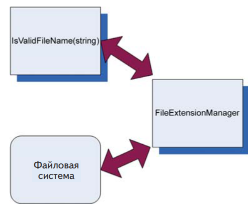
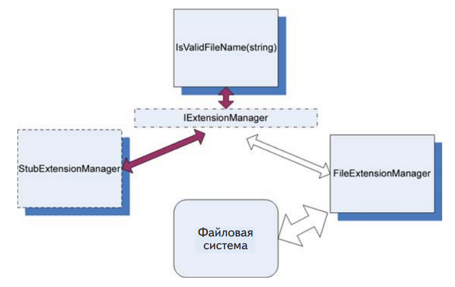
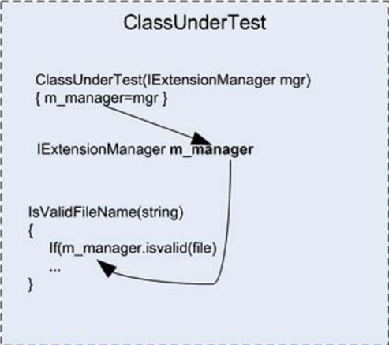
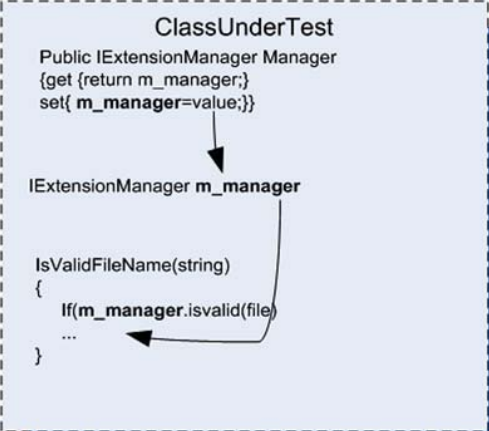
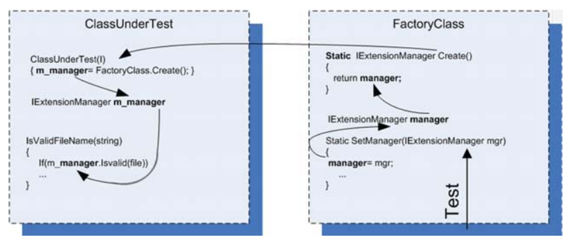
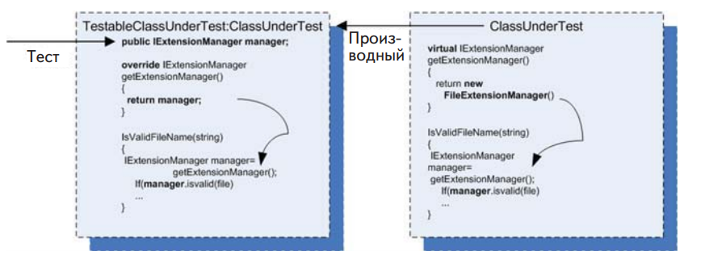
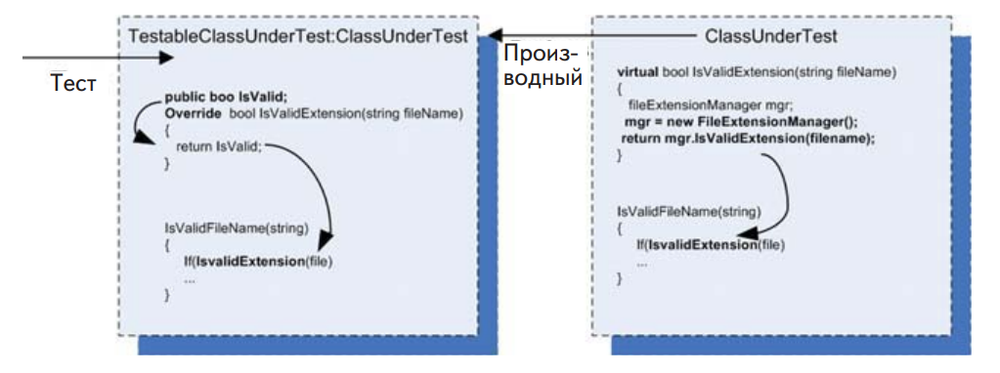

# Использование заглушек для разрыва зависимостей

В этой главе:

 - Определение заглушки.
 - Рефакторинг кода с целью использования заглушек.
 - Добавляем текст и название.
 - Решение проблемы инкапсуляции.
 - Рекомендации по использованию заглушек.

В предыдущей главе мы написали первый автономный тест с применением NUnit и рассмотрели несколько тестовых атрибутов. Мы также подготовили тесты для простых случаев, когда нужно было лишь
проверить возвращаемое значение метода или состояние тестируемой
автономной единицы в тривиальной системе.

В этой главе мы рассмотрим более реалистичные примеры, когда
тестируемый объект зависит от других объектов, которые мы не контролируем (или еще не реализовали). Таким объектом может быть
веб-служба, текущее время, потоки и многое другое. Важно, что тест
не может управлять тем, что возвращает зависимость и как она себя
ведет (например, если вы захотите смоделировать исключение). Тутто и приходят на помощь заглушки.

## Введение в заглушки

Полет человека в космос ставит ряд интересных задач перед инженерами и космонавтами, и одна из самых сложных – как удостовериться, что космонавт готов к полету и способен эксплуатировать всю технику, находясь на орбите. Для проведения полного интеграционного теста космический челнок следовало бы запустить в космос, но, очевидно, что это не самый безопасный способ испытания космонавтов.
Поэтому НАСА разработала полнофункциональные имитационные установки, копирующие окружение и панель управления космического корабля, чтобы устранить внешнюю зависимость от космического пространства.

**Определение**. Внешней зависимостью называется объект в системе, с которым тестируемый код взаимодействует, но над которым у него нет контроля (типичные примеры: файловая система, потоки, память, время и т. д.).

Управление внешними зависимостями из вашей программы и есть
тема настоящей главы и большей части книги. В программировании
для обхода проблемы внешних зависимостей применяются заглушки.

**Определение**. Заглушкой называется управляемая замена существующей
зависимости (или компаньона) в системе. Используя заглушку, мы можем
протестировать код, не взаимодействуя с зависимостью непосредственно.

В главе 4 мы более точно определим, что такое заглушки, подставные и поддельные объекты и как они взаимосвязаны. А пока запомните, что подставные объекты (mocks) – это те же заглушки, только
о подставном объекте можно высказывать утверждения, а о заглушке – нет.

Рассмотрим пример и усложним класс LogAnalyzer, введенный в
предыдущей главе. Нам предстоит устранить зависимость от файловой системы 

Названия паттернов тестирования
Классическим справочником по паттернам автономного тестирования является книга Gerard Meszaros «xUnit Test Patterns: Refactoring Test Code» (Addison-Wesley, 2007)1. В ней есть по меньшей мере пять определений сущностей,
имитируемых в тестах, и мне кажется, что это только вносит путаницу (хотя
все определения детализированы). В этой книге я использую только три
определения имитируемых сущностей: поддельные объекты, или подделки
(fakes), заглушки (stubs) и подставные объекты, или подставки (mocks). Я полагаю, что при такой упрощенной терминологии читателю будет легче
освоить паттерны, а для того чтобы начать писать отличные тесты, ничего
больше знать и не нужно. Впрочем, в некоторых местах я буду ссылаться
на названия паттернов, употребляющиеся в «xUnit Test Patterns», чтобы при
желании вы могли найти определение, данное Мезарошем.


## Выявление зависимости от файловой системы в LogAn

Класс LogAnalyzer можно настроить так, что он будет обрабатывать
файлы журналов с разными расширениями, пользуясь адаптерами
для каждого типа. Для простоты предположим, что допустимые расширения хранятся где-то на диске в конфигурационном файле приложения и что метод IsValidLogFileName выглядит следующим образом:

```C#
public bool IsValidLogFileName(string %leName)
{
// читать конфигурационный файл
// вернуть truе, если конфигурация говорит, что расширениие поддерживается
}
```

Беда в том, что коль скоро тест
зависит от файловой системы, то мы имеем
интеграционный тест со всеми вытекающими
проблемами: медленная работа, зависимость
от конфигурации, тестирование сразу многих
сторон и т. д.

Наш
метод напрямую
зависит от файловой
системы. Структура
тестируемой
объектной модели
не дает возможности
протестировать
его автономно, мы
вынуждены перейти
к интеграционному
тестированию


В этом и состоит сущность нетестопригодной структуры: код зависит от некоторого внешнего ресурса, и эта зависимость может стать
причиной отказа теста, когда логика кода совершенно корректна. В унаследованных системах одна единица работы (действие в системе)
может зависеть от многочисленных внешних
ресурсов, которые тест может контролировать
в слабой степени или вообще не может.

## Как можно легко протестировать LogAnalyzer

«Любую объектно-ориентированную задачу можно решить, добавив
уровень косвенности, если, конечно, число уровней косвенности не
слишком велико». Мне нравится эта цитата (из статьи в википедии
по адресу http://en.wikipedia.org/wiki/Abstraction_layer), поскольку
немалая доля «искусства» в искусстве автономного тестирования как
раз и состоит в том, чтобы найти нужное место для добавления или
использования уровня косвенности, позволяющее протестировать
продуктовый код.
Не удается что-то протестировать? Добавьте уровень косвенности , обертывающий обращения к этому «чему-то», а затем имитируйте
этот уровень в своих тестах. Или сделайте это «что-то» подменяемым
(так что оно само представляет собой уровень косвенности). Искусство состоит также в том, чтобы понять, что нужный уровень косвенности уже существует, и не изобретать его заново, а также в том, чтобы вовремя воздержаться от использования косвенности, потому что
она слишком усложняет дело. Но давайте двигаться шаг за шагом.
Единственный способ протестировать показанный выше код в таком виде – создать конфигурационный файл в файловой системе. Но
мы хотим избежать подобных зависимостей и сделать код тестопригодным, не прибегая к интеграционному тестированию
Обратившись к исходной аналогии с космонавтом, мы обнаруживаем четкий принцип разрыва зависимости.

1. Найти интерфейс или API, через который работает тестируемый объект. В случае космонавта это ручки управления и мониторы космического корабля.
2. Заменить истинную реализацию этого интерфейса чем-то, что
мы можем контролировать. Это означает, что различные мониторы, джойстики и кнопки следует подключить к пультовой,
откуда инженеры-испытатели могут управлять тем, что интерфейс корабля показывает испытуемым космонавтам.

Для переноса этого принципа на наш код потребуются дополнительные шаги.

1. Найти интерфейс, через который работает начало тестируемой единицы работы. (В данном случае слово «интерфейс»
употребляется не в строго объектно-ориентированном смысле, имеется в виду метод или класс, с которым взаимодействует единица работы.) В проекте LogAn таковым является
конфигурационный файл в файловой системе.
2. Если интерфейс соединен с тестируемой единицей работы
напрямую (как в данном случае — мы непосредственно обращаемся к файловой системе), сделать код тестопригодным,
добавив уровень косвенности, скрывающий интерфейс. В нашем примере это можно было бы сделать, переместив обращение к файловой системе в отдельный класс (например,
FileExtensionManager ). Позже мы рассмотрим и другие способы (на рис. 3.3 показано, как могла бы выглядеть структура
программы после этого шага).
3. Заменить истинную реализацию интерфейса чем-то, что мы
можем контролировать. В данном случае мы заменяем класс,
к которому обращается метод (FileExtensionManager)
классом-заглушкой, который можем контролировать
(StubExtensionManager ), и тем самым даем тесту возможность управлять внешними зависимостями.
Подменный класс вообще не обращается к файловой системе, т. е.
мы разорвали зависимость от файловой системы. Но поскольку мы тестируем не класс, общающийся с файловой системой, а код, который его вызывает, то вполне можно смириться с тем, что класс-заглушка не делает ничего полезного, а лишь довольно лепечет, когда к
нему обращаются из теста. На рис. 3.4 показано, во что превратилась
структура программы после такого изменения.


Добавление уровня косвенности, чтобы избежать
прямой зависимости от файловой системы. Код, обращающийся
к файловой системе, вынесен в класс FileExtensionManager,
который в тесте будет заменен заглушкой



Добавление заглушки для разрыва зависимости.
Теперь классу ничего не нужно знать о том, с какой реализацией
диспетчера расширений он работает

На рис. 3.4 я включил в общую картину интерфейс в смысле C#.
Он позволяет объектной модели абстрагировать операции класса
FileExtensionManager, а тесту – создать заглушку, которая выглядит в точности, как FileExtensionManager. В следующем разделе
мы рассмотрим эту технику более детально.
Это был один из способов сделать продуктовый код тестопригодным – создание нового интерфейса. Теперь обсудим идею рефакторинга кода и включения в него зазоров.

## Рефакторинг проекта с целью повышения тестопригодности

Настало время ввести еще два термина, которые будут постоянно
встречаться в этой книге: рефакторинг и зазоры.

**Определение**. **Рефакторингом** называется операция изменения кода без
изменения его функциональности. Иными словами, код делает в точности
то же, что и раньше. Не больше и не меньше. Просто выглядит по-другому.
В качестве примеров рефакторинга можно назвать переименование метода
или разбиение одного длинного метода на несколько более коротких


**Определение**. **Зазорами** (seam) называются места программы, куда можно подключить иную функциональность взамен существующей, например:
классы-заглушки, добавление параметра конструктора, добавление открытого свойства, допускающего установку, преобразование метода в виртуальный, чтобы его можно было переопределить, или вынесение наружу делегата
в виде параметра или свойства, чтобы его можно было задавать вне класса.
Зазор – это то, что получается в результате следования принципу открытости-закрытости , когда функциональность класса открыта для расширения,
но его исходный код закрыт для прямой модификации (о зазорах см. книгу
Michael Feathers «Working Effectively with Legacy Code»3, а о принципе открытости-закрытости – книгу Роберта Мартина «Чистый код»).

Мы можем подвергнуть код рефакторингу, включив новый зазор
без изменения исходной функциональности, что я и сделал, добавив
новый интерфейс IExtensionManager.
И обязательно подвергнем.
Но прежде хочу напомнить, что бесшабашный рефакторинг кода
без каких-нибудь автоматизированных тестов (интеграционных или
иных) может завести вас в кроличью нору, которая станет концом карьеры.
Прежде чем вносить любые изменения в существующий код,
подстрахуйтесь интеграционными тестами или хотя бы составьте
план отступления – сделайте сначала копию кода, предпочтительно в
системе управления версиями, снабдив ее четко видным примечанием «до начала рефакторинга», чтобы потом легко найти.

Чтобы разорвать зависимости между тестируемым кодом и файловой системой, мы можем внести в код один или несколько зазоров.
Нужно только помнить о том, что новый код должен делать в точности то же, что и раньше. Существует два взаимосвязанных типа рефакторинга для разрыва зависимостей. Я буду называть их рефакторинг
типа А и рефакторинг типа Б.
- Тип А – абстрагирование конкретных объектов путем преобразования их в интерфейсы или делегаты.
- Тип Б – внедрение поддельных реализаций этих делегатов или
интерфейсов.

В перечне ниже только первый способ является рефакторингом
типа А, остальные – рефакторинг типа Б.

Тип А – выделение интерфейса с целью подмены истинной реализации.
Тип Б – внедрение реализации заглушки в тестируемый класс.
Тип Б – внедрение подделки на уровне конструктора
Тип Б – внедрение подделки в виде чтения либо установки
свойства.
Тип Б – внедрение подделки непосредственно перед вызовом
метода.

Рассмотрим все эти способы поочередно.

## Выделение интерфейса с целью подмены истинной реализации

При таком подходе необходимо вынести весь код, относящийся к работе с файловой системой, в отдельный класс. Тогда его можно будет
легко обособить и впоследствии подменить при обращении из тестов
(как было показано на рис. 3.3). В следующем листинге показаны места кода, которые нужно изменить.

Листинг 3.1. Выделение класса, содержащего операции с файловой
системой, и обращение к нему

```C#

public bool IsValidLogFileName(string %leName)
{
 FileExtensionManager mgr = new FileExtensionManager();
 return mgr.IsValid(%leName);
}
class FileExtensionManager
{
 public bool IsValid(string %leName)
 {
 // Здесь читается файл
 }
}
```

Затем мы можем изменить тестируемый класс, так чтобы вместо
конкретного класса FileExtensionManager использовалась какая-то
форма ExtensionManager, о конкретной реализации которой класс
ничего не знает. В .NET для этого применяется базовый класс или
интерфейс, которому наследует FileExtensionManager.

В следующем листинге показано, как использовать новый интерфейс, чтобы сделать класс более тестопригодным. Структура такой
реализации показана на рис. 3.4.

Листинг 3.2. Extracting an interface from a known class

```C#

public class FileExtensionManager : IExtensionManager
{
 public bool IsValid(string %leName)
 {
 ...
 }
}
public interface IExtensionManager
{
 bool IsValid (string %leName);
}
// 
public bool IsValidLogFileName(string %leName)
{
 IExtensionManager mgr = new FileExtensionManager();
 return mgr.IsValid(%leName);
}

```

Мы создаем интерфейс с одним методом IsValid(string). Класс
FileExtensionManager реализует этот интерфейс. Работает он так
же, как и раньше, но теперь мы можем заменить «настоящий» Manager
«поддельным», который ниже создадим для поддержки тестирования.
Мы еще не создали класс-заглушку для диспетчера расширений,
так не будем откладывать в долгий ящик. Код показан в следующем
листинге.

Листинг 3.3. Простой метод-заглушка, который всегда возвращает true

```C#
public class AlwaysValidFakeExtensionManager:IExtensionManager
{
 public bool IsValid(string %leName)
 {
 return true;
 }
}
```

Прежде всего, обратите внимание на имя класса. Оно очень важно.
Не StubExtensionManager и не MockExtensionManager , а именно
FakeExtensionManager. Слово fake (поддельный) означает, что объект выглядит, как другой объект, но может использоваться как подставка или заглушка (подставным объектам посвящена следующая
глава).
Говоря, что объект или переменная является подделкой, мы откладываем решение о том, как назвать этот объект-имитацию, и избегаем
путаницы, которая могла бы возникнуть, если бы мы назвали его диспетчером-подставкой или диспетчером-заглушкой.
Услышав слово «подставка» или «заглушка», человек ожидает
определенное поведение, которое мы обсудим позже. Мы не хотим
уточнять имя этого класса, потому что он создан таким образом, что
может выступать в обеих ролях, чтобы в будущем его можно было
использовать в разных тестах.
Этот поддельный диспетчер расширений всегда возвращает true,
поэтому мы назвали класс AlwaysValidFakeExtensionManager , чтобы читатель будущего теста, даже не заглядывая в исходный код, понимал, какого поведения ожидать от поддельного объекта.
Это лишь одно из возможных решений, и оно может привести к
лавинообразному росту числа таких «рукописных» подделок. «Рукописными» мы называем подделки, написанные вручную, без использования порождающего каркаса. Ниже в этой главе я покажу другой
способ конфигурирования подделок.
Эту подделку можно и в таком виде использовать в тестах, устранив тем самым зависимость от файловой системы, но можно также
добавить в нее код, который позволит имитировать возбуждение любого исключения. Об этом тоже чуть ниже.
Итак, у нас есть интерфейс и два реализующих его класса, однако
тестируемый метод по-прежнему вызывает настоящую реализацию
напрямую:

```C#
public bool IsValidLogFileName(string %leName)
{
 IExtensionManager mgr = new FileExtensionManager();
 return mgr. IsValid (%leName);
}
```

Нужно как-то сказать этому методу, чтобы он использовал нашу, а
не исходную реализацию IExtensionManager. Необходимо ввести в
код зазор, в который можно будет вставить нашу заглушку.


## Внедрение зависимости: внедрение поддельной реализации в тестируемую единицу работы

Существует несколько проверенных способов создания зазоров на
основе интерфейсов – мест, куда можно внедрить реализацию интерфейса, чтобы ей пользовались методы класса. Перечислим наиболее
распространенные:

- получить интерфейс в конструкторе и сохранить его в поле для последующего использования;
- получить интерфейс в свойстве и сохранить его в поле для последующего использования;
- получить интерфейс непосредственно перед вызовом в тестируемом методе одним из следующих способов:
   * в виде параметра метода (внедрение через параметр);
   * с помощью фабричного класса;
   * с помощью локального фабричного метода;
   * варианты вышеупомянутых способов.

Метод внедрения через параметр тривиален: передаем экземпляр
(поддельной) зависимости рассматриваемому методу, добавив в его
сигнатуру дополнительный параметр.
Рассмотрим остальные решения и подумаем, когда какое применять.

## Внедрение подделки на уровне конструктора (внедрение через конструктор)

В этом случае мы добавляем новый конструктор (или параметр в существующий конструктор), который будет принимать объект типа созданного ранее интерфейса (IExtensionManager). Этот конструктор
инициализирует поле класса типа интерфейса, которое впоследствии
сможет использовать наш или любой другой метод. На рис. 3.5
показана схема внедрения заглушки.



В листинге ниже показано, как можно было бы написать тест класса
LogAnalyzer с применением техники внедрения через конструктор.

Листинг 3.4. Внедрение заглушки через конструктор

```C#
public class LogAnalyzer
{
 private IExtensionManager manager;
 public LogAnalyzer(IExtensionManager mgr)
 {
 manager = mgr;
 }
 public bool IsValidLogFileName(string %leName)

{
 return manager.IsValid(%leName);
 }
}
public interface IExtensionManager
{
 bool IsValid(string %leName);
}
[TestFixture]
public class LogAnalyzerTests
{
 [Test]
 public void
 IsValidFileName_NameSupportedExtension_ReturnsTrue()
 {
 FakeExtensionManager myFakeManager =
 new FakeExtensionManager();
 myFakeManager.WillBeValid = true;
 LogAnalyzer log =
 new LogAnalyzer (myFakeManager);
 bool result = log.IsValidLogFileName(“short.ext”);
 Assert.True(result);
 }
}
internal class FakeExtensionManager : IExtensionManager
{
 public bool WillBeValid = false;
 public bool IsValid(string %leName)
 {
 return WillBeValid;
 }
}

```

**Примечание**. Поддельный диспетчер расширений находится в том же файле, что тестовый код, потому что в данный момент подделка используется
только в этом тестовом классе. Если рукописная подделка находится в том
же файле, то найти, прочитать и сопровождать ее будет гораздо проще.
Но если впоследствии эта подделка понадобится еще в каком-то классе,
то мы сможем вынести ее в отдельный файл с помощью инструмента типа
ReSharper (который я горячо рекомендую). См. приложение.

Отметим также, что поддельный объект в листинге 3.4 отличается
от того, что мы видели раньше. В тесте его можно настроить, указав, какое булево значение следует возвращать при вызове метода. Благодаря возможности настройки мы сможем использовать класс заглушки в нескольких тестах – тесту нужно будет сконфигурировать
заглушку, перед тем как передавать тестируемому объекту. Это также
делает код теста более понятным, потому что читатель находит все необходимое в одном месте. Удобочитаемость – важная характеристика
автономных тестов, о которой мы будем подробно говорить позже,
особенно в главе 8.
Еще следует отметить, что, используя параметры конструктора,
мы по существу намеренно делаем их обязательными зависимостями
(в предположении, что это единственный конструктор). Пользователь этого типа будет обязан задать в аргументах все необходимые
ему конкретные зависимости.

## Недостатки внедрения через конструктор

Использование конструкторов для внедрения зависимостей иногда чревато неприятностями. Если тестируемому коду для корректной работы без зависимостей необходимо несколько заглушек, то добавление все новых и новых конструкторов (или новых параметров
конструктора) может стать проблемой. Код даже может оказаться
неудобочитаемым или плохо сопровождаемым.
Допустим, что класс LogAnalyzer зависит не только от диспетчера
расширений файлов, но еще от веб-службы и службы протоколирования. Тогда конструктор может выглядеть следующим образом:

```C#
public LogAnalyzer(IExtensionManager mgr, ILog logger, IWebService service)
{
 // #
 manager = mgr;
 log= logger;
 svc= service;
}
```

Для решения проблемы можно было бы создать специальный
класс, содержащий все необходимое для инициализации данного
класса и передавать конструктору только один параметр: объект этого класса. Этот подход иногда называют рефакторингом параметрического объекта. Правда, если у такого объекта окажется несколько
десятков свойств, то целесообразность решения будет сомнительна,
но тем не менее так поступить можно.
Другое решение – воспользоваться контейнерами инверсии управления (inversion of control – IoC). IoC-контейнер можно рассматривать как «умную фабрику» объектов (хотя это далеко не все, на что
они способны). Из популярных контейнеров такого рода упомянем
Microsoft Unity, StructureMap и Castle Windsor. Они предоставляют
специальные фабричные методы, которые принимают тип создаваемого объекта и все необходимые ему зависимости, после чего инициализируют объект, применяя специальные настраиваемые правила,
например: какой конструктор вызывать, какие свойства устанавливать и в каком порядке и т. д. Они умеют работать со сложными
иерархиями объектов, когда для создания одного объекта требуется
создать и инициализировать несколько других, лежащих ниже него в
иерархии. Например, если конструктору нашего объекта необходимо
передать интерфейс ILogger , то контейнер можно настроить так, что,
пытаясь удовлетворить это требование, он будет возвращать один и
тот же объект типа ILogger. Как правило, применение контейнеров
упрощает порождение нужных объектов и причиняет меньше хлопот
в части зависимостей и сопровождения конструкторов.

## Когда использовать внедрение через конструктор

Мой опыт показывает, что использование аргументов конструктора для инициализации объектов может сделать тестовый код более
громоздким, если не пользоваться для создания объектов вспомогательными каркасами типа IoC-контейнеров. Но все же я предпочитаю именно этот способ, потому что это наименьшее из зол в плане понятности и удобочитаемости API.
Кроме того, использование параметров конструктора – лучший
способ дать понять пользователю API, что параметры обязательны.
Их необходимо задать, чтобы получить объект.
Если вы хотите, чтобы зависимости были необязательными, обратитесь к разделу 3.4.5. Там обсуждаются методы чтения и установки
свойств – способ задания необязательных зависимостей, не столь суровый, как, скажем, добавление в класс конструкторов для каждой
зависимости.
Если вы хотите, чтобы зависимости были необязательными, обратитесь к разделу 3.4.5. Там обсуждаются методы чтения и установки
свойств – способ задания необязательных зависимостей, не столь суровый, как, скажем, добавление в класс конструкторов для каждой
зависимости.

Если вы остановитесь на внедрении через конструктор, то, наверное,
захотите использовать IoC-контейнер. Это решение было бы замечательно, если бы все программы в мире пользовались IoC-контейнерами, однако большинство людей ничего не знают о принципе инверсии
управления, не говоря уже об инструментах, позволяющих воплотить
его в жизнь. В будущем автономное тестирование, наверное, все чаще
будет опираться на такие каркасы. И тогда появятся более ясные и
четкие рекомендации по проектированию классов с зависимостями.
Либо мы увидим инструменты, которые решают проблему внедрения
зависимости вообще без конструкторов.
Как бы то ни было, параметры конструктора – лишь одно из возможных решений. Не менее часто используются и свойства.

## Имитация исключений от подделок

Ниже приведен простой пример того, как сделать класс-подделку
настраиваемым, чтобы вызванный метод мог возбуждать любое исключение. Для определенности предположим, что тестируется следующее требование: если диспетчер расширений файлов возбуждает
исключение, то нужно вернуть false и воспрепятствовать дальнейшему распространению исключения (да, в реальной программе так делать не следует, но не ругайте меня – это всего лишь пример).

```C#
[Test]
public void
IsValidFileName_ExtManagerThrowsException_ReturnsFalse()
{
 FakeExtensionManager myFakeManager = new FakeExtensionManager();
 myFakeManager.WillThrow = new Exception(“#”);
 LogAnalyzer log = new LogAnalyzer (myFakeManager);
 bool result = log.IsValidLogFileName(“anything.anyextension”);
 Assert.False(result);
}
internal class FakeExtensionManager : IExtensionManager {
 public bool WillBeValid = false;
 public Exception WillThrow = null ;
 public bool IsValid(string %leName)
 {
 if(WillThrow !=null) {
 throw WillThrow;
 }
 return WillBeValid;
 }
}
```
Чтобы этот тест прошел, мы должны написать код, который вызывает диспетчер расширений внутри блока try-catch и возвращает
false, если мы попали в catch.

## Внедрение подделки через установку свойства

В этом случае мы устанавливаем свойство с методами get и set для
каждой зависимости, которую хотим внедрить. Затем тестируемый
код использует эту зависимость, когда она ему понадобится. На
рис. 3.6 показана схема внедрения с помощью свойств.
Тестовый код, в котором применяется эта техника (она тоже называется внедрением зависимости, как и все остальные описанные в
этой главе приемы), будет выглядеть почти так же, как приведенный
в разделе 3.4.3, где зависимость внедрялась через конструктор. Однако этот код (см. листинг ниже) проще писать и читать.



Внедрение зависимостей с помощью свойств.
Это гораздо проще, чем использовать конструктор,
потому что каждый тест может устанавливать
только те свойства, которые ему нужны

Листинг 3.5. Внедрение подделки путем добавления установщиков
свойств в тестируемый класс

```C#
public class LogAnalyzer
{
 private IExtensionManager manager;
 public LogAnalyzer ()
 {
 manager = new FileExtensionManager();
 }
 public IExtensionManager ExtensionManager
 {
 get { return manager; }
 set { manager = value; }
 }
 public bool IsValidLogFileName(string %leName)
 {
 return manager.IsValid(%leName);
 }
}
[Test]
public void IsValidFileName_SupportedExtension_ReturnsTrue()
{
 // задать используемую заглушку, настроитьее на возврат true
 ...
 // создать анализатор и внедрить заглушку
 LogAnalyzer log = new LogAnalyzer ();
 log.ExtensionManager=someFakeManagerCreatedEarlier;
 // сделать утверждение в предположении, что расширение поддерживается
 ...
}


```


Внедрение через свойства, как и через конструктор, влияет на дизайн API в плане решения, какие зависимости обязательны, а какие –
нет. Использование свойств означает, что зависимость не обязательна для работы типа.

## Когда использовать внедрение через свойство

Эта техника применяется, чтобы подчеркнуть, что зависимость
тестируемого класса необязательна или может быть создана по умолчанию, не порождая проблем во время тестирования.

## Внедрение подделки непосредственно перед вызовом метода

В этом разделе мы рассмотрим случай получения объекта непосредственно перед началом операций с ним, а не через конструктор или
свойство. Разница в том, что запрос заглушки инициирует тестируемый код, тогда как в предыдущих разделах объект-подделка создавался вне тестируемого кода до начала тестирования.

## Использование фабричного класса

В этом случае мы возвращаемся к исходному варианту, когда класс
инициализирует диспетчер в своем конструкторе, однако экземпляр
получаем от фабричного класса. Паттерн проектирования «Фабрика» (Factory) описывает ситуацию, когда за создание объектов отвечает отдельный класс.

В тестах необходимо будет сконфигурировать фабричный класс (в
данном случае он будет содержать статический метод, который возвращает объект, реализующий интерфейс IExtensionManager), так
чтобы он возвращал заглушку вместо настоящей реализации. Эта
схема показана на рис. 3.7.



 Тест настраивает фабричный класс, так чтобы
тот возвращал объект-заглушку. Тестируемый класс обращается
к фабрике за экземпляром и в продуктовом коде получит
настоящий объект, а не заглушку.

Дизайн на основе фабричных классов отличается чистотой, поэтому во многих объектно-ориентированных системах он применяется
для порождения объектов. Но в большинстве систем никто, кроме самого фабричного класса, не может решать, какой экземпляр возвращать, чтобы не нарушать инкапсуляцию фабрики.
Однако в данном случае я добавил в фабричный класс метод установки (еще один зазор), чтобы у тестов было больше контроля над
тем, что возвращает фабрика. Коль скоро в тестах появились статические данные, вероятно, понадобится восстанавливать начальное
состояние фабрики до или после выполнения каждого теста, чтобы
избежать влияния на последующие.
При таком подходе получается тест, код которого легко читать, а
обязанности четко разделены между классами. Каждый отвечает за
свое действие.
В следующем листинге показано использование фабричного класса в LogAnalyzer (тест тоже включен).

Листинг 3.6. Настройка фабричного класса, так чтобы тот возвращал
заглушку при вызове из теста

```C#
public class LogAnalyzer
{
 private IExtensionManager manager;
 public LogAnalyzer ()
 {
 manager = ExtensionManagerFactory.Create();
}
 public bool IsValidLogFileName(string %leName)
 {
 return manager.IsValid(%leName)
 && Path.GetFileNameWithoutExtension(%leName).Length>5;
 }
}
[Test]
public void IsValidFileName_SupportedExtension_ReturnsTrue()
{
 // true
 ...
 ExtensionManagerFactory.SetManager(myFakeManager);
 // 
 LogAnalyzer log = new LogAnalyzer ();
 // 
 ...
}
class ExtensionManagerFactory
{
 private IExtensionManager customManager=null;
 public IExtensionManager Create()
 {
 if(customManager!=null)
 return customManager;
 return new FileExtensionManager();
 }
 public void SetManager(IExtensionManager mgr)
 {
 customManager = mgr;
 }
}


```

Единственное, о чем нужно помнить при использовании этих паттернов, – необходимость добавить зазор, чтобы фабрика могла возвращать заглушку вместо настоящей реализации. Во многих системах имеется глобальный переключатель #debug – если он включен,
то в зазоры автоматически вставляются поддельные или тестопригодные объекты вместо реализаций по умолчанию. Соответствующая
настройка может оказаться муторным делом, но затраты окупятся
сторицей, когда придет время тестировать систему.

## Сокрытие зазоров в выпускном режиме

Что, если вы не хотите показывать зазоры в выпускном режиме ?
Есть несколько способов решить эту задачу. Например, в .NET можно
поместить относящийся к зазорам код (дополнительный конструктор, установщик свойства или настройку фабрики) в условно компилируемую секцию.

## Различные уровни косвенности

В этом разделе мы имеем дело с более глубокой иерархией уровней, чем в предыдущих. На каждом уровне можно подделывать (или
заглушать) различные объекты. В таблице показаны три уровня программы, на которых можно возвращать заглушки.

Таблица. Уровни кода, на которых возможна подделка объектов

| Тестируемый код   |Возможное действие    |
|:---|:---|
|Уровень 1: переменная типа FileExtensionManager внутри класса    |Добавить в конструктор аргумент, который будет использоваться для передачи зависимости. Теперь член тестируемого класса – подделка, больше ничего не меняется.    |
|Уровень 2: тестируемый класс получает зависимость от фабричного класса|С помощью установки некоторого свойства сообщить фабричному классу о необходимости возвращать зависимость. Подделкой является член фабричного класса, а в тестируемом классе ничего не меняется.
|Уровень 3: фабричный класс, который возвращает зависимость|Подменить экземпляр фабричного класса поддельной фабрикой, которая возвращает поддельную зависимость. Подделкой является фабрика, которая возвращает подделку; в тестируемом классе ничего не меняется.|

Говоря об уровнях косвенности, следует понимать, что чем глубже
мы спускаемся по кроличьей норе (то бишь по стеку вызовов в программе), тем больше возможностей манипулировать тестируемым. кодом, поскольку создаваемые заглушки имеют более широкую сферу ответственности. Но у такого подхода есть и обратная сторона:
чем глубже уровень, тем труднее понять тест и тем сложнее найти
подходящее место для зазора. Искусство состоит в том, чтобы отыскать разумный баланс между сложностью и разнообразием способов
манипулирования, так чтобы тесты оставались удобочитаемыми, но
мы при этом полностью контролировали ситуацию в тестируемом
коде.

Для случая, показанного в листинге 3.6 (использование фабрики),
добавление аргумента в конструктор только усложнило бы код, в котором и так есть вполне подходящий уровень для размещения зазора – фабрика на уровне 2. Здесь воспользоваться уровнем 2 проще
всего, так как это требует минимального изменения кода.

- Уровень 1 (подделка члена тестируемого класса) – потребуется
добавить конструктор, инициализировать член класса в конструкторе, задать параметры конструктора в тесте и думать о
будущем использовании этого API в продуктовом коде. При
таком подходе изменяется семантика работы с тестируемым
классом, а этого лучше избегать, если нет основательной причины.
- Уровень 2 (подделка члена фабричного класса) – здесь все просто. Нужно лишь добавить установщик свойства в фабрику и
записать в это свойство желаемую поддельную зависимость.
Семантика продуктового кода не изменяется, все остается, как
было, и код прост, как правда. Единственный минус состоит в
том, что мы должны понимать, кто и когда вызывает фабрику,
а это значит, что до начала реализации нужно провести некоторые изыскания. Разобраться в продуктовом коде, который вы
раньше в глаза не видели, – задача не из простых, но все равно
этот вариант представляется лучше прочих
- Уровень 3 (подделка фабричного класса) – мы должны создать
собственный вариант фабричного класса, для которого может
и не быть интерфейса. В таком случае придется создать и интерфейс тоже. После этого предстоит создать экземпляр поддельной фабрики, которая будет возвращать класс поддельной
зависимости (подделка возвращает подделку – супер!), и настроить поддельный фабричный класс в тестируемом классе.
Идея подделки, возвращающей подделку, вообще плохо укладывается в голове, поэтому такого подхода лучше избегать,
если мы хотим, чтобы тест оставался понятным.

## Поддельный метод – использование локального фабричного метода  (выделить и переопределить)

Этого способа нет ни на одном уровне в табл. 3.1; он создает совершенно новый уровень косвенности близко к поверхности тестируемого кода. Чем ближе к поверхности, тем меньше придется возиться
с изменением зависимостей. В данном случае тестируемый класс сам
является в некотором роде зависимостью, которой требуется манипулировать.
При таком подходе мы используем виртуальный метод самого тестируемого класса как фабрику, которая возвращает экземпляр диспетчера расширений. Поскольку метод виртуальный, его можно переопределить в производном классе, создав тем самым зазор. Внедрение
в класс заглушки сводится к наследованию тестируемого класса ради
переопределения виртуального фабричного метода. Тестированию затем подвергается производный класс. Фабричный метод в этом случае можно также назвать методом-заглушкой, который возвращает
объект-заглушку. На рис. 3.8 показана соответствующая схема создания объектов.


Мы наследуем тестируемому классу и переопределяем
его виртуальный метод, возвращая из него нужный нам объект,
который реализует интерфейс IExtensionManager.
Затем тестированию подвергается производный класс

Ниже перечислены шаги использования фабричного метода при
тестировании.

В тестируемом классе:

- добавить виртуальный фабричный метод, который возвращает настоящий экземпляр;
- воспользоваться этим фабричным методом, как обычно.
  
В тестовом проекте:

- создать новый класс;
- унаследовать новый класс от тестируемого;
- создать открытое поле (необязательно делать его свойством,
допускающим чтение и установку) типа интерфейса, который
должна реализовывать подделка (IExtensionManager);
- переопределить виртуальный фабричный метод;
- вернуть открытое поле.

В коде теста:
- создать экземпляр класса-заглушки, который реализует
требуемый интерфейс (IExtensionManager);
- создать экземпляр производного класса вместо тестируемого;
- записать в вышеупомянутое открытое поле этого экземпляра ссылку на созданный экземпляр класса-заглушки.

Теперь благодаря переопределенному фабричному методу при тестировании продуктового класса будет использоваться подделка.
Вот как может выглядеть код, в котором применяется описанный
способ.

Листинг 3.7. Подделка фабричного метода

```C#
public class LogAnalyzerUsingFactoryMethod
{
 public bool IsValidLogFileName(string %leName)
 {
 return GetManager().IsValid(%leName);
 }
 protected virtual IExtensionManager GetManager()
 {
 return new FileExtensionManager();
 }
}
[TestFixture]
public class LogAnalyzerTests
{
 [Test]
 public void overrideTest()
 {
 FakeExtensionManager stub = new FakeExtensionManager();
 stub.WillBeValid = true;
 TestableLogAnalyzer logan =
 new TestableLogAnalyzer(stub);


 bool result = logan.IsValidLogFileName(“%le.ext”);
 Assert.True(result);
 }
}
class TestableLogAnalyzer : LogAnalyzerUsingFactoryMethod
{
 public TestableLogAnalyzer(IExtensionManager mgr)
 {
 Manager = mgr;
 }
 public IExtensionManager Manager;
 protected override IExtensionManager GetManager()
 {
 return Manager;
 }
}
internal class FakeExtensionManager : IExtensionManager
{
 // то же, что в предыдущих примерах
J
 ...
}

```
Описанная техника называется «выделить и переопределить»; воспользовавшись ей пару раз, вы поймете, насколько это просто. В этой
книге я буду применять ее и для других целей.

Мощь техники выделения и переопределения проистекает из того,
что она позволяет непосредственно подменить зависимость, не спускаясь в кроличью нору (то есть без подмены зависимости в глубоко
вложенном коде). Поэтому ее можно реализовать быстро и чисто,
хотя это может прийтись не по вкусу объектно-ориентированному эстету, т. к. получается код, в котором меньше интерфейсов, но больше
виртуальных методов. Я люблю называть этот способ «выдернуть и
переопределить» (ex-crack and override), и считаю, что, приобретя эту
привычку, от нее уже трудно избавиться.

## Когда использовать эту технику

Техника «выделить и переопределить» хороша при моделировании
входных данных для тестируемого кода, но оказывается громоздкой, если требуется проверить, как зависимость реагирует на данные, исходящие из тестируемого кода.
Например, она очень удобна, если код обращается к веб-службе,
получает от нее возвращаемое значение , а мы хотим смоделировать
эту ситуацию, вернув значение сами. Но все становится куда хуже,
если мы хотим проверить, правильно ли код отвечает на запрос к
веб-службе. В этом случае потребуется многое кодировать вручную,
и для таких задач больше подходят изолирующие каркасы (как мы
убедимся в следующей главе). Техника «выделить и переопределить»
хороша, когда требуется имитировать возврат значений или целых
интерфейсов, возвращающих значения, но не годится для проверки
взаимодействий между объектами.
Я часто применяю эту технику, когда хочу имитировать входные
данные для тестируемого кода, поскольку она позволяет несколько
уменьшить количество изменений в семантике продуктового кода
(добавление интерфейсов, конструкторов и т. д.), необходимых только для того, чтобы сделать его тестопригодным. А отказываюсь я от
нее в том единственном случае, когда в продуктовом коде уже проложен для меня очевидный путь: существует интерфейс, который только и ждет, чтобы его подделали, или есть место, куда можно внедрить
зазор. Если ничего такого нет, и сам класс не является запечатанным
(или его можно сделать таковым, не вызывая гнева у коллег), то я
первым делом изучаю возможность применения этой техники, а уже
потом перехожу к более сложным альтернативам.

## Варианты рефакторинга

У описанных выше простых методик введения зазоров в исходный
код существует много вариантов. Например, параметр можно добавлять не в конструктор, а непосредственно в тестируемый метод.
Вместо передачи интерфейса можно передавать базовый класс. И так
далее. У каждого варианта есть свои плюсы и минусы.
Но использовать базовый класс вместо интерфейса не всегда желательно, в частности потому, что в продуктовом коде базовый класс,
возможно, уже имеет зависимости, о которых вы должны знать и которые должны подменить. Поэтому реализовывать для тестирования
производные классы сложнее, чем интерфейсы, так как в последнем
случае мы точно знаем, что представляет собой истинная реализация,
и имеем полный контроль над ней.
В главе 4 мы увидим, как можно уйти от самостоятельного написания подделок, реализующих интерфейсы, прибегнув к помощи каркасов, которые делают это во время выполнения.
А пока рассмотрим другой способ получить контроль над тестируемым кодом без использования интерфейсов. Выше мы уже встречались с подобным примером, но эта методика настолько эффективна,
что заслуживает отдельного обсуждения.


Использование техники выделения и переопределения
для возврата логического результата вместо фактического вызова
зависимости. Здесь вместо вызова заглушки просто отдается
поддельный результат

## Использование выделения и переопределения для создания поддельных результатов

Мы уже видели пример выделения и переопределения в разделе 3.4.5.
Идея в том, чтобы унаследовать тестируемому классу и переопределить в нем виртуальный метод, так чтобы он возвращал нашу заглушку.
Но почему надо на этом останавливаться? Что, если мы не можем
или не хотим добавлять новый интерфейс, всякий раз как требуется
получить контроль над каким-то поведением тестируемого класса?
В таких случаях техника выделения и переопределения может упростить дело, потому что не требует добавления новых интерфейсов –
достаточно унаследовать тестируемому классу и переопределить его
поведение.
На рис. 3.9 показан еще один способ заставить тестируемый код
всегда возвращать true в ответ на вопрос о допустимости расширения файла.
В тестируемом классе виртуализируется не фабричный метод, а
результат вычисления. Это означает, что в производном классе переопределенный метод возвращает нужное нам значение без необходимости создавать интерфейс или новую заглушку.
В листинге ниже продемонстрировано использование этой техники.

Листинг 3.8. Выделенный метод возвращает результат,
а не объект-заглушку

```C#
public class LogAnalyzerUsingFactoryMethod
{
 public bool IsValidLogFileName(string %leName)
 {
 return this.IsValid(%leName);
 }
 protected virtual bool IsValid(string %leName)
 {
 FileExtensionManager mgr = new FileExtensionManager();
 return mgr.IsValid(%leName);
 }
}
[Test]
public void overrideTestWithoutStub()
{
 TestableLogAnalyzer logan = new TestableLogAnalyzer();
 logan.IsSupported = true;
 bool result = logan.IsValidLogFileName(“%le.ext”);
 Assert.True(result,”...”);
}
class TestableLogAnalyzer: LogAnalyzerUsingFactoryMethod
{
 public bool IsSupported;
 protected override bool IsValid(string %leName)
 {
 return IsSupported;
 }
}
```

## Когда использовать технику выделения и переопределения

Основной побудительный мотив использования этой техники тот
же, что в случае способа, обсуждавшегося в разделе 3.4.5. Если есть возможность, то я использую именно эту технику, потому что она гораздо проще.
Наверное, сейчас вы думаете, что добавление всех этих конструкторов, установщиков свойств и фабрик ради удобства тестирования –
решение спорное. Тем самым мы нарушаем некоторые фундаментальные принципы объектно-ориентированного проектирования и, в
первую очередь, принцип инкапсуляции, который гласит: «Скрывай
все, что пользователю классу не нужно видеть». Этим вопросом мы и
займемся далее.

## Преодоление проблемы нарушения инкапсуляции

Некоторые полагают, что приоткрывать внутреннюю структуру кода
ради удобства тестирования плохо, потому что при этом нарушаются
принципы объектно-ориентированного проектирования. Со всей определенностью могу им сказать: «Не валяйте дурака». Объектно-ориентированные методики придуманы, для того чтобы наложить ограничения на конечного пользователя API (каковым является программист,
пользующийся вашей объектной моделью) и защитить объектную
модель от неправильного и непредусмотренного использования.
Объектная ориентация подразумевает также повторное использование
кода и принцип единственной обязанности (требующий, чтобы у
каждого класса была только одна обязанность).
Разрабатывая автономные тесты для своего кода, вы добавляете
еще одного пользователя объектной модели (тест). Этот пользователь не менее важен, чем первоначальный, но у него другие цели. Тест
предъявляет к объектной модели требования, которые, на первый
взгляд, вступают в противоречие с несколькими принципами объектно-ориентированного проектирования и, прежде всего, с инкапсуляцией. Инкапсуляция внешних зависимостей без возможности их
изменять, наличие закрытых конструкторов, запечатанных классов
и невиртуальных методов, которые нельзя переопределить, – все это
классические признаки перестраховочного дизайна (вопросы безопасности – это особая статья, тут я не возражаю). Проблема в том,
что второму пользователю API, тесту, эти зависимости нужны не
меньше, чем полезные функции кода. Я называю проектирование с
учетом необходимости тестирования «тестопригодным объектно-ориентированным проектированием » (ТООП). Мы еще вернемся к
ТООП в главе 11.
Идея тестопригодного проектирования , по мнению некоторых, противоречит идее объектно-ориентированного проектирования. Для
тех, кому просто жизненно необходимо примирить оба мира (и рыбку
съесть, и косточкой не подавиться), я опишу несколько приемов, позволяющих скрыть дополнительные конструкторы и установщики свойств
в выпускной версии или, по крайней мере, уменьшить их значимость.

## internal и [InternalsVisibleTo]

Если вам не нравится, что все пользователи класса могут видеть
открытый конструктор, поставьте модификатор internal вместо
public. Затем все внутренние члены и методы можно сделать видимыми тестовой сборке, добавив атрибут [InternalsVisibleTo] на
уровне сборки. Детали показаны в следующем листинге.

Листинг 3.9. Раскрытие внутренних членов тестовой сборке

```C#
public class LogAnalyzer
{
 ...
 internal LogAnalyzer (IExtensionManager extentionMgr)
 {
 manager = extentionMgr;
 }
 ...
}
using System.Runtime.CompilerServices;
[assembly:InternalsVisibleTo(“AOUT.CH3.Logan.Tests”)]

```

Такой код обычно помещается в файл AssemblyInfo.cs. Использование internal — хорошее решение в тех случаях, когда нет другого
способа открыть внутреннюю структуру класса тестовому коду.

## Атрибут [Conditional]

Атрибут System.Diagnostics.ConditionalAttribute печально известен своим интуитивно неочевидным поведением. Если этот атрибут добавляется к методу, то его аргументом служит строка, содержащая имя условного параметра, передаваемого компилятору на этапе
сборки (наиболее известны параметры DEBUG и RELEASE, которые в
Visual Studio используются по умолчанию в соответствии с типом
сборки).
Если на этапе сборки соответствующий параметр не задан, то
все вызовы аннотированного метода не включаются в исполняемый
файл. Например, при наличии в программе показанного ниже метода
все обращения к нему удаляются из выпускной версии6
, но сам этот
метод в ней остается.

```C#
[Conditional (“DEBUG”)]
public void DoSomething()
{
}
```

Этот атрибут можно применять к методам (но не к конструкторам), которые должны вызываться только в некоторых отладочных
режимах.

## Использование директив #if и #endif для условной компиляции

Если поместить методы или специальные конструкторы, предназначенные только для тестирования, между директивами #if и #endif,
то они будут компилироваться, только когда при сборке задан соответствующий флаг.

Листинг 3.10. Использование специальных флагов при сборке

```C#
#if DEBUG
public LogAnalyzer (IExtensionManager extensionMgr)
{
 manager = extensionMgr;
}

#endif
...
#if DEBUG
[Test]
public void IsValidFileName_SupportedExtension_True()
{
 ...
 // создать анализатор и внедрить заглушку
 LogAnalyzer log = new LogAnalyzer (myFakeManager);
 ...
}
#endif

```
Этот метод применяется часто, но при неумеренном употреблении
приводит к неразборчивому коду. Подумайте об использовании атрибута [InternalsVisibleTo], так код станет яснее.

## Выводы

В первых двух главах мы начали с написания простых тестов, но в
них были зависимости, которые нужно было как-то обойти. В этой
главе мы научились заглушать зависимости, применяя интерфейсы
и наследование.
Заглушку можно внедрить в код разными способами. Хитрость в
том, чтобы найти или создать правильный уровень косвенности, а затем использовать его как зазор, позволяющий вставить в работающий
код заглушку.
Мы называем такие классы подделками, поскольку не хотим поручать им только роль заглушек или подставок.
Чем глубже уровень взаимодействия, тем труднее понять тест, сам
тестируемый код и его взаимодействия с другими объектами. Чем
ближе к поверхности тестируемого объекта, тем проще разобраться
в тесте и настроить его, но, возможно, придется отказаться от некоторых средств контроля над окружением тестируемого объекта.
Изучайте различные пути внедрения заглушек в код. Овладев ими
в совершенстве, вы сумеете с большей уверенностью выбрать наиболее подходящий метод из арсенала имеющихся.
Техника «выделить и переопределить» прекрасно подходит, когда
нужно имитировать входные данные для тестируемого кода, но если
требуется также протестировать взаимодействия между объектами
(тема следующей главы), то возвращайте интерфейс, а не просто значение. Так вы упростите себе жизнь.
ТООП обладает рядом интересных преимуществ по сравнению с
классическим объектно-ориентированным проектированием, например, оно обеспечивает удобство сопровождения, не ограничивая возможность писать тесты продуктового кода.
В главе 4 мы рассмотрим другие проблемы, связанные с зависимостями, и покажем, как они решаются; обсудим, как уйти от рукописных подделок интерфейсов и как тестировать взаимодействия между
объектами в автономных тестах.


