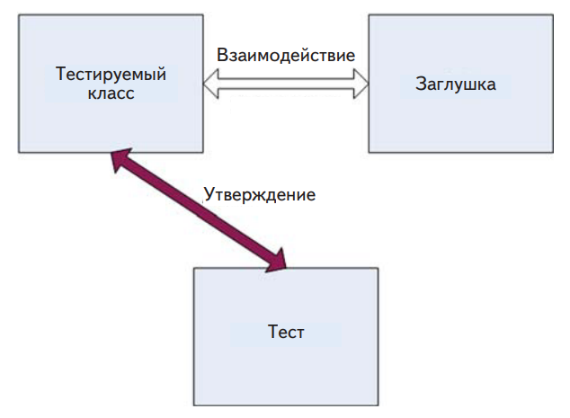
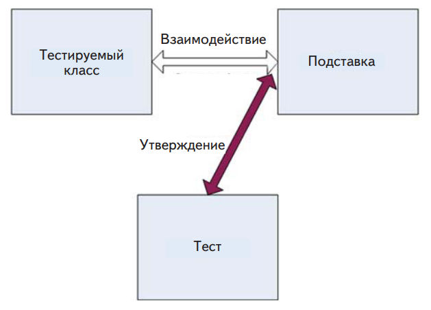
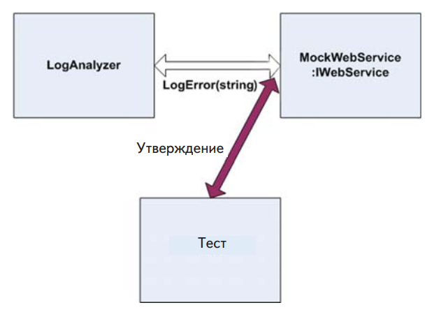
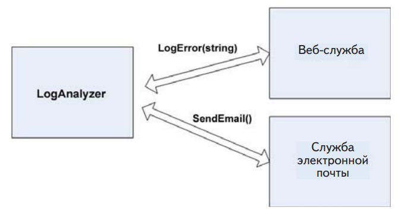

В этой главе:
 - Что такое тестирование взаимодействий.
 - Что такое подставные объекты.
 - Различия между подделками, подставками и
заглушками.
 - Рекомендации по работе с подставными объектами.

В предыдущей главе мы решили проблему тестирования кода, зависящего от других объектов. Благодаря заглушкам мы обеспечили
тестируемый код нужными ему входными данными, и, как следствие,
смогли независимо протестировать его логику.
Но до сих пор мы писали только тесты единиц работы, результаты
которых относятся к первым двум типам: возврат значения и изменение состояния системы.

В этой главе мы рассмотрим, как тестировать результаты третьего
типа – обращение к стороннему объекту. Мы проверим, правильно
ли объект вызывает другие объекты. Тестируемый объект может не
возвращать значение и не сохранять состояние, но при этом иметь
сложную логику, правильное выполнение которой должно приводить
к вызовам других объектов, не находящихся под вашим контролем
и не являющихся частью тестируемой единицы работы. Применение изученных выше приемов здесь ничего не даст, потому что не существует никакого API, который можно было бы вынести наружу
и использовать для проверки изменений в состоянии тестируемого
объекта. Как убедиться, что наш объект правильно взаимодействует c
другими? С помощью подставных объектов.
Первым делом следует определить, что такое тестирование взаимодействий и чем оно отличается от уже знакомых нам видов тестирования – на основе значений и состояния.

## Сравнение тестирования взаимодействий с тестированием на основе значений и состояния

В главе 1 я определил три типа конечных результатов, порождаемых
единицей работы. Теперь я определю тестирование взаимодействий,
которое имеет непосредственное отношение к результатам третьего
типа: обращение к стороннему компоненту. В случае тестирования на
основе значений мы проверяем значение, возвращенное функцией.
В случае тестирования на основе состояния проверяются видимые
изменения в состоянии тестируемой системы – после выполнения
действия, изменяющего состояние.

**Определение**. Тестированием взаимодействий называется проверка того,
как объект посылает сообщения другим объектам (вызывает их методы). Такой вид тестирования применяется, когда конечным результатом единицы
работы является обращение к другому объекту.

Можно считать, что тестирование взаимодействий управляется
действиями . Это означает, что проверяется, какое действие предпринимает объект (например, отправляет сообщение другому объекту).
Тестирование взаимодействий всегда следует оставлять на крайний случай. Это очень важная мысль. Сначала убедитесь, что никак
не можете протестировать единицу работы по результатам первых
двух типов (значение и состояние), потому что тесты взаимодействий
оказываются многократно сложнее. Но иногда, как, например, при обращении к стороннему средству протоколирования, взаимодействия
между объектами и являются конечным результатом. В таком случае
делать нечего – придется тестировать само взаимодействие.
Хочу отметить, что не все согласны с тем, что подставные объекты
следует использовать, только когда нет никаких других способов протестировать код. В книге «Growing Object-Oriented Software, Guided
by Tests» ее авторы Стив Фримэн (Steve Freeman) и Нат Прайс (Nat
Pryce) пропагандируют идеологию так называемой «лондонской школы TDD», в которой подставки и заглушки используются как средство унификации проектирования ПО. Не то чтобы я был полностью
не согласен с таким способом проектирования кода. Но эта книга не о
проектировании, а, если говорить только об удобстве сопровождения,
то в моих тестах использование подставок создает больше проблем,
чем отказ от них. Повторяю, это мой личный опыт, но я постоянно
изучаю новые веяния. Не исключено, что в следующем издании этой
книги моя точка зрения на этот предмет будет прямо противоположной.
Тестирование взаимодействий в том или ином виде существовало
с первых дней автономного тестирования. Тогда для него еще не было
ни названия, ни паттернов, но знать-то, что один объект правильно
вызывает другой, все равно было необходимо. Однако при реализации этой идеи часто либо перебарщивали, либо плохо старались, поэтому тесты получались несопровождаемыми и неудобочитаемыми.
Потому-то я и рекомендую по возможности тестировать результаты
двух других типов.
Чтобы разобраться в плюсах и минусах тестирования взаимодействий, рассмотрим пример. Допустим, имеется система орошения, и
вы настроили время полива дерева у себя в саду: сколько раз в день и
каким количеством воды. Есть два способа проверить правильность
работы системы:
- Интеграционный тест на основе состояния (именно интеграционный, а не автономный). Запустить систему на 12 часов,
в течение которых она должна полить дерево несколько раз.
В конце периода проверить состояние политого дерева. Достаточно ли влажная земля, хорошо ли дерево себя чувствует,
зеленые ли листья и т. д. Такой тест может оказаться довольно
трудным, но если вы в состоянии его выполнить, то сможете
определить, работает ли система орошения. Я называю этот
тест интеграционным, потому что он о-о-очень медленный и
для его проведения необходимо все окружение системы орошения.
- Тестирование взаимодействий. На конце шланга закрепить
устройство, которое регистрирует время полива и количество
прошедшей через него воды. В конце дня проверить, что устройство срабатывало нужное число раз и всякий раз регистрировало ожидаемый объем воды. А о дереве вообще не думать.
На самом деле, для проверки работоспособности системы
дерево и не нужно. Можно пойти дальше и модифицировать
синхрогенератор в блоке орошения (подставив вместо него
заглушку), чтобы система думала, что время полива настало
в момент, когда вам будет удобно. Тогда, чтобы проверить ее
работу, не нужно будет ждать (в данном примере 12 часов).

Как видите, в этом случае тест взаимодействия может заметно упростить жизнь. Но иногда лучше тестировать на основе состояния, потому что организовать тестирование взаимодействий слишком сложно. Так обстоит дело с манекенами для аварийных испытаний: автомобиль врезается в неподвижное препятствие на определенной скорости, а после столкновения результат испытания определяется по
состоянию автомобиля и манекенов. Проведение такого испытания в
лаборатории в виде теста взаимодействия может оказаться слишком
сложным, поэтому предпочтение отдается физическим испытаниям
с последующей оценкой состояния. (Ученые и инженеры работают
над компьютерными моделями столкновений, но пока они еще очень
далеки от натурных испытаний.)

Но вернемся к системе орошения. Что это за устройство, которое
регистрирует информацию о поливе? Это поддельный шланг, заглушка, если хотите. Только это очень умная заглушка – она запоминает
обращения к себе. Мы используем ее, чтобы понять, прошел тест или
нет. Это и есть одна из характеристик подставного объекта. А синхрогенератор, который мы заменили подделкой? Это заглушка, потому
что всего лишь моделирует время, чтобы было удобнее тестировать
другую часть системы.

**Определение**. Подставным объектом называет такой поддельный объект,
который определяет, прошел автономный тест или нет. Для этого он проверяет, что тестируемый объект вызывал поддельный так, как ожидается. Обычно
в каждом тесте участвует не более одного подставного объекта.

На первый взгляд, подставной объект не слишком отличается от
заглушки, но на самом деле различия настолько велики, что заслуживают отдельного обсуждения и даже специального синтаксиса в
различных каркасах, как мы убедимся в главе 5. Мы уточним, в чем
они состоят.

Сейчас, когда у вас уже есть представление о подделках, подставках и заглушках, я могу привести формальное определение поддельного объекта.

**Определение**. Поддельный объект , или подделка – это общий термин для
обозначения заглушек и подставок (рукописных и прочих), поскольку те и
другие имитируют настоящий объект. Считать ли объект заглушкой или подставкой, зависит от способа его использования в тесте. Если объект применяется для проверки взаимодействия (и относительно него высказывается
утверждение), то это подставка. В противном случае – заглушка.

Копнем глубже и рассмотрим внимательнее разницу между двумя
типами подделок.

## Различия между подставками и заглушками

Заглушки подменяют объект, чтобы можно было протестировать другой объект. На рис. 4.1 показано взаимодействие между заглушкой и
тестируемым классом.



При использовании заглушки утверждение
высказывается относительно тестируемого класса.
Заглушка – лишь вспомогательное средство
для выполнения теста

Различие между подставками и заглушками важно, потому что во
многих современных инструментах и каркасах (а также в статьях)
этими терминами обозначаются разные вещи. Важно оно и потому,
что при изучении тестов, написанных другими людьми, необходимо
понимать, что присутствует более одного подставного объекта, – это
существенное умение, о котором еще будет речь ниже. Относительно смысла этих терминов существует путаница, и многие, похоже, считают их синонимами. Но, поняв, в чем разница, вы сможете более осознанно оценивать инструменты, каркасы и API и лучше понимать, что
они делают.
На первый взгляд, различие между подставками и заглушками
может показаться несущественным или даже не существующим. Разница тонкая, но она важна, т. к. во многих изолирующих каркасах, с
которыми мы будем иметь дело в следующих главах, эти термины
употребляются для описания разных видов поведения каркаса. Основное различие в том, что заглушка не может стать причиной отказа
теста. А подставка может.
Основополагающее свойство заглушки – тот факт, что она не влияет на исход теста. Утверждения высказываются только относительно
тестируемого класса, но не заглушки.
С другой стороны, подставной объект анализируется, чтобы узнать,
прошел тест или нет. На рис. 4.2 показано взаимодействие между тестом и подставным объектом. Обратите внимание, что утверждение
высказано относительно подставки.



Тестируемый класс взаимодействует с подставным
объектом и взаимодействие регистрируется внутри подставки.
Подставной объект используется, чтобы узнать,
прошел тест или нет

Еще раз повторим, что подставка – это объект, с помощью которого
мы узнаем, прошел тест или нет. Проиллюстрируем эти идеи в действии, построив собственный подставной объект.

## Пример простой рукописной подставки

Подставной объект создается и используется практически так же, как
заглушка, только делает он чуть побольше заглушки: сохраняет историю взаимодействия, которую впоследствии можно проверить в виде
ожиданий.
Введем еще одно требование к классу LogAnalyzer. Теперь он должен передавать внешней веб-службе сообщение об ошибке всякий
раз, как встретит слишком короткое имя файла.
К сожалению, веб-служба, взаимодействие с которой требуется
протестировать, еще не готова, а даже если бы она и работала в полном объеме, все равно обращаться к ней из тестов было бы слишком
долго. Поэтому мы подвергнем проект рефакторингу и создадим новый интерфейс, для реализации которого впоследствии можно будет
написать подставной объект. В интерфейсе будут объявлены методы,
необходимые для вызова веб-службы, и ничего более.
На рис. 4.3 показано место подставного класса FakeWebService
в тесте.


Рис. 4.3. В тесте создается объект FakeWebService
для регистрации сообщений, полученных от LogAnalyzer.
Затем мы сможем высказать утверждение
относительно FakeWebService

Первым делом выделим простой интерфейс, которым можно будет воспользоваться в тестируемом коде вместо прямого обращения
к веб-службе:

```C#
public interface IWebService
{
 void LogError(string message);
}
```

Этот интерфейс пригодится и в том случае, если мы захотим создавать не только подставки, но и заглушки. Он позволяет подменить
внешнюю зависимость, которую мы не контролируем.
Затем создаем сам подставной объект. Выглядит он, как заглушка,
но содержит дополнительный код, превращающий его в подставку

```C#
public class FakeWebService:IWebService
{
 public string LastError;
 public void LogError(string message)
 {
 LastError = message;
 }
}
```

Этот написанный вручную класс реализует интерфейс, как и заглушка, но еще сохраняет некоторое состояние, чтобы впоследствии
тест мог сделать утверждение и проверить, что подставка вызывалась
правильно. Однако пока это еще не подставной объект. Таковым он
станет, лишь когда мы используем его в этом качестве в тесте.

В следующем листинге приведен код теста.

Листинг 4.1. Тестирование класса LogAnalyzer с помощью подставного
объекта

```C#
[Test]
public void Analyze_TooShortFileName_CallsWebService()
{
 FakeWebService mockService = new FakeWebService();
 LogAnalyzer log = new LogAnalyzer(mockService);
 string tooShortFileName=”abc.ext”;
 log.Analyze(tooShortFileName);
 StringAssert.Contains(“ Слишком короткое имя файла
: abc.ext”,
 mockService.LastError);
}
public class LogAnalyzer
{
private IWebService service;
 public LogAnalyzer(IWebService service)
 {
 this.service = service;
 }
 public void Analyze(string %leName)
 {
 if(%leName.Length<8)
 {
 service.LogError(“Слишком короткое имя файла: 
: “
 + %leName);
 }
 }
}

```

Обратили внимание, что утверждение высказано относительно
подставного объекта, а не объекта LogAnalyzer? Это потому, что мы
тестируем взаимодействие между LogAnalyzer и веб-службой. Мы
применяем те же приемы внедрения зависимости, что и в главе 3, но
на этот раз исход теста определяется подставным объектом (который
используется вместо заглушки).

Также отметим, что проверка вынесена за пределы кода подставного объекта. Тому есть две причины.

- Мы хотели бы иметь возможность повторно использовать этот
подставной объект в других тестах, где относительно сообщения делаются другие утверждения.
- Если бы утверждение было помещено внутрь рукописного класса подделки, то читатель теста не смог бы понять, что утверждается. Мы убрали из кода теста существенную информацию, сделав его менее удобочитаемым и удобным для сопровождения.

Возможно, в своих тестах вы встретитесь с необходимостью подменять сразу несколько объектов. Далее мы рассмотрим комбинирование заглушек и подставок. Вы увидите, что несколько заглушек в
одном тесте – совершенно обычное дело, а вот наличие нескольких
подставок может свидетельствовать о методической ошибке, поскольку означает, что тестируется более одного аспекта.

## Совместное использование   заглушки и подставки

Рассмотрим более сложную задачу. На этот раз LogAnalyzer должен
обратиться к веб-службе, а если та вернет ошибку, то записать эту ошибку в другую внешнюю зависимость, отправив по электронной
почте сообщение администратору веб-службы (рис. 4.4).



У класса LogAnalyzer две внешних зависимости:
веб-служба и служба электронной почты.
Мы должны протестировать логику LogAnalyzer
при обращении к ним

Вот как выглядит логика класса LogAnalyzer:

```C#
if(%leName.Length<8)
{
 try
 {
 service.LogError(“ Слишком короткое имя файла
: “ + %leName);
 }
 catch (Exception e)
 {
 email.SendEmail(“a”,”subject”,e.Message);
 }
}
```
Обратите внимание, что здесь имеет место только взаимодействие с внешними объектами; никакие значения не возвращаются и
состояние системы не изменяется. Как проверить, что LogAnalyzer
правильно вызывает почтовую службу, если веб-служба возбуждает
исключение?

Вот на какие вопросы мы должны ответить:
- как подменить веб-службу?
- как имитировать исключение от веб-службы, чтобы можно было протестировать обращение к почтовой службе?
- как узнать, что почтовая служба была вызвана правильно, да и
вообще вызвана?

Для ответа на первые два вопроса можно воспользоваться заглушкой веб-службы. Для решения третьей проблемы понадобится подставка почтовой службы.

В нашем тесте будет два поддельных объекта. Один – подставная
почтовая служба, с помощью которой мы проверим, что почтовой
службе были переданы правильные параметры. Второй – заглушка, которая позволит имитировать исключение, возбужденное вебслужбой. Это именно заглушка, потому что мы не станем использовать поддельную веб-службу для проверки исхода теста, она нужна
только лишь для обеспечения его работы. Почтовая же служба является подставкой, потому что мы высказываем утверждение относительно правильности обращения к ней. Это наглядно показано на
рис. 4.5.


В следующем листинге показана реализация схемы, изображенной
на рис. 4.5.

Листинг 4.2. Тестирование LogAnalyzer с помощью заглушки
и подставки


```C#
public interface IEmailService
{
void SendEmail(string to, string subject, string body);
}
public class LogAnalyzer2
{
 public LogAnalyzer2(IWebService service, IEmailService email)
 {
 Email = email,
 Service = service;
 }
 public IWebService Service
 {
 get ;
 set ;
 }
 public IEmailService Email
 {
 get ;
 set ;
 }
 public void Analyze(string %leName)
 {
 if(%leName.Length<8)
 {
 try
 {
 Service.LogError(“Слишком короткое имя
: “ + %leName);
 }
 catch (Exception e)
 {
 Email.SendEmail(“someone@somewhere.com”,
 “can’t log”,e.Message);
 }
 }
 }
}
[TestFixture]
public class LogAnalyzer2Tests
{
 [Test]
 public void Analyze_WebServiceThrows_SendsEmail()
 {
 FakeWebService stubService = new FakeWebService();
 stubService.ToThrow= new Exception(“fake exception”);
 FakeEmailService mockEmail = new FakeEmailService();
 LogAnalyzer2 log = new LogAnalyzer2(stubService,mockEmail);

 string tooShortFileName=”abc.ext”;
 log.Analyze(tooShortFileName);
 StringAssert.Contains(“someone@somewhere.com”,mockEmail.To);
 StringAssert.Contains(“fake exception”,mockEmail.Body);
 StringAssert.Contains(“can’t log”,mockEmail.Subject);
 }
}
public class FakeWebService:IWebService
{
 public Exception ToThrow;
 public void LogError(string message)
 {
 if(ToThrow!=null)
 {
 throw ToThrow;
 }
 }
}
public class FakeEmailService:IEmailService
{
 public string To;
 public string Subject;
 public string Body;
 public void SendEmail(string to,
 string subject,
 string body)
 {
 To = to;
 Subject = subject;
 Body = body;
 }
}

```

Стоит отметить несколько интересных моментов в этом коде.

- Иногда наличие нескольких утверждений представляет проблему, потому что первое ложное утверждение возбуждает
специальное исключение, перехватываемое исполнителем
тестов. Это означает, что все строки после этого утверждения
вообще не будут выполнены. В данном конкретном случае все
хорошо, так как если какое-то утверждение оказалось ложно,
то остальные нас уже не интересуют, поскольку относятся к
тому же объекту и являются частями одной и той же «функции».

- Если вам необходимо, чтобы последующие утверждения были
проверены, даже если первое оказазалось ложным, то это
верный признак того, что данный тест следует разбить на несколько. Или можно было бы завести новый класс EmailInfo
с тремя атрибутами и передавать объект этого класса методу
SendMail, а затем в тесте создать экземпляр этого класса с
ожидаемыми свойствами. Тогда удалось бы обойтись одним
утверждением.

Вот как это выглядело бы:


```C#
class EmailInfo
{
 public string Body;
 public string To;
 public string Subject;
}
[Test]
public void Analyze_WebServiceThrows_SendsEmail()
{
 FakeWebService stubService = new FakeWebService();
 stubService.ToThrow= new Exception(“fake exception”);
 FakeEmailService mockEmail = new FakeEmailService();
 LogAnalyzer2 log = new LogAnalyzer2(stubService,mockEmail);
 string tooShortFileName=”abc.ext”;
 log.Analyze(tooShortFileName);
 EmailInfo expectedEmail = new EmailInfo {
 Body = “fake exception”,
 To = “someone@somewhere.com”,
 Subject = “can’t log”
 }
 Assert.AreEqual(expectedEmail, mockEmail.email);
}
public class FakeEmailService:IEmailService
{
 public EmailInfo email = null;
 public void SendEmail(EmailInfo emailInfo)
 {
 email = emailInfo;
 }
}

```

Если имеется ссылка на сам объект, который ожидается в качестве
результата, то можно было бы записать такое утверждение:

```C#
Assert.AreSame(expectedEmail, mockEmail.email);
```

Еще один важный вопрос – сколько заглушек и подставок можно
использовать в одном тесте.


## Одна подставка на тест

В тесте, где проверяется что-то одно (а именно так я рекомендую писать тесты), не должно быть более одного подставного объекта. Все
остальные поддельные объекты должны выступать в роли заглушек.
Наличие нескольких подставок в одном тесте обычно означает, что
тестируется более одного аспекта, такие тесты часто оказываются
слишком сложными или хрупкими (подробнее об этом см. главу 8).
Если вы будете следовать этой рекомендации, то при переходе к
более сложным тестам всегда сможете спросить себя: «Который тут
объект-подставка?» Выявив подставной объект, вы сможете оставить
остальные заглушками и не высказывать относительно них утверждений. (Если вы все же обнаружите утверждения относительно подделок, которые явно используются как заглушки, насторожитесь. Это
признак избыточного специфицирования.)
Избыточное специфицирование имеет место, когда вы говорите,
что должно произойти слишком много вещей, о которых ваш тест и
знать-то не должен, например, что вызываются заглушки. Из-за таких
лишних спецификаций тест может не пройти по причинам, не имеющим отношения к делу: вы внесли изменения в продуктовый код, но
хотя его конечный результат по-прежнему правилен, тест ругается:
«Я не прошел! Ты сказал, что этот метод должен вызываться, а он не
вызывался! Хнык!»
Тогда вам придется постоянно изменять тесты, приводя их в соответствие с внутренней реализацией кода. В конечном итоге вам
это надоест, вы зададитесь вопросом «И за каким чертом я все это
делаю?» и начнете удалять докучливые тесты.
Игра окончена.
Специфицируйте только один из трех возможных типов результата единицы работы, иначе окажетесь в аду, смерть будет собирать
свою жатву и ангелы низринутся с небес. Я вас предупредил.
Далее мы рассмотрим более сложный сценарий: использование заглушки для возврата подделки (подставки или заглушки), которая и
будет использоваться в приложении.

## Цепочки подделок: заглушки, порождающие подставки или другие заглушки

Один из самых распространенных в наши дни видов мошенничества
устроен очень просто. Большому количеству получателей отправляется поддельное сообщение электронной почты. В этом сообщении от
мошеннического банка или онлайновой службы говорится, что клиент должен проверить свой баланс или внести какие-то изменения в
учетную запись на сайте.
Все ссылки в сообщении ведут на поддельный сайт. Он выглядит
точно так же, как настоящий, но создан с единственной целью: собирать данные о ничего не подозревающих клиентах этого бизнеса.
По существу, мы имеем поддельное письмо, ведущее на поддельный
сайт. Это простенькая цепочка вранья называется фишинговой атакой и оказывается куда более прибыльным делом, чем вы можете себе
представить.
Но к чему этот разговор? Да к тому, что иногда требуется, чтобы
поддельный объект возвращал (из метода или свойства) другой поддельный компонент, так что порождается цепочка заглушек, заканчивающаяся подставным объектом где-то глубоко в недрах системы, и
этот подставной объект позволяет собрать какие-то данные во время
теста. Мы можем создать заглушку, которая порождает подставной
объект, запоминающий данные.
Дизайн многих тестируемых систем допускает создание сложных
цепочек объектов. Нередко можно встретить код такого вида:

```C#
IServiceFactory factory = GetServiceFactory();
IService service = factory.GetService();
```

Или такого:

```C#
String connstring =
 GlobalUtil.Con%guration.DBCon%guration.ConnectionString;
```

Предположим, что на время тестирования мы хотим заменить
строку соединения. Можно было бы сделать свойство Con%guration
объекта GlobalUtil объектом-заглушкой. Затем точно также мы
превратили бы в заглушку свойство DBCon%guration и в конечном
итоге вернули бы поддельный объект, который можно было бы использовать как подставку или заглушку строки соединения.

Техника, безусловно, мощная, но стоит задаться вопросом, не лучше ли переработать код как-то так:

```C#
string connstring = GetConnectionString();
protected virtual string GetConnectionString()
{
return GlobalUtil.Con%guration.DBCon%guration.ConnectionString;
}
```

А затем переопределить виртуальный метод, как описано в главе 3 (раздел 3.4.5). Такой код будет проще читать и сопровождать и
не потребуется вводить новые интерфейсы, чтобы вставить в систему
еще две заглушки.

Совет. Есть еще один неплохой способ избежать цепочек вызовов – создать
специальные классы, обертывающие API, чтобы упростить его использование и тестирование. Подробнее об этом методе читайте в книге Майкла
Фэзерса «Эффективная работа с унаследованным кодом», где этот паттерн
называется «Адаптация параметра».

У рукописных заглушек и подставок есть достоинства, но и проблемами они также не обделены. Рассмотрим последние более пристально.

## Проблемы рукописных заглушек и подставок

 При использовании рукописных заглушек и подставок возникают
следующие проблемы:

- на их написание требуется время;
- трудно писать заглушки и подставки для классов и интерфейсов с большим количеством методов, свойств и событий;
- для сохранения состояния при вызовах методов подставки
приходится писать много стереотипного кода;
- для проверки того, что параметры метода правильно заданы
вызывающей стороной, необходимы многочисленные утверждения – писать их скучно и долго;
- повторно использовать заглушку или подставку в других тестах трудно. В простых случаях все работает, но если в интерфейсе более двух-трех методов, то сопровождать код становится утомительно.

Существует ли в программе такое место, где подделка выступает
одновременно в роли заглушки и подставки? Очень редко – может быть, одно-два места во всем проекте. Мне такое доводилось встречать всего пару разу за последние два года.

Подставка может оказаться заглушкой, если требуется воспользоваться подставным объектом, в котором есть метод, возвращающий
значение. Чтобы компилятор не ругался (ох, уж эти статические языки – подставляют нас на каждом углу), поддельный объект тоже должен возвращать какое-то фиктивное значение, иначе код не только
не выполнится, но даже не откомпилируется. Вот в таком случае подставка оборачивается одновременно заглушкой, но я утверждаю, что
если подставной объект возвращает системе какое-то значение, то,
скорее всего, вы изначально тестируете не тот конечный результат.
Я обычно ищу такие результаты, которые являются обращениями к
сторонней системе, не возвращающими ничего. Меня интересуют в
первую очередь методы типа void. Иногда система спроектирована
так, что метод, обращающийся к стороннему компоненту, все же возвращает значение (так часто делают при программировании на C++
для информирования об ошибках). Это чуть ли не единственный случай, когда я готов смириться с тем, что подставка является и заглушкой тоже. Приведу пример:

```C#
public interface IComNoti%cationService
{
 int SendNoti%cation(string info);
}
```

В данном случае если конечным результатом работы является вызов метода SendNoti%cation , то подставной объект используется для
проверки того, что метод вызывался, но, чтобы удовлетворить компилятор, придется также вернуть какое-то значение, которое, однако, в
данном тесте безразлично.
Я перечислил проблемы, свойственные ручному написанию заглушек и подставок. По счастью, есть и другие способы их создания, с
которыми мы познакомимся в следующей главе.

### Выводы

В этой главе мы рассмотрели различие между заглушками и подставными объектами. Подставной объект похож на заглушку, но относительно него можно высказывать утверждения в тесте. Заглушка
никогда не является причиной отказа теста и существует только для
имитации различных ситуаций. Это различие существенно, потому
что подразумевается во многих каркасах для генерации подставок, с которыми мы познакомимся в следующей главе, так что вы должны
понимать, когда использовать подставку, а когда – заглушку.
Комбинирование заглушек и подставок в одном тесте – действенная техника, но нужно следить за тем, чтобы в каждом тесте было не
более одной подставки. Все остальные поддельные объекты должны
быть заглушками, не способными привести к отказу теста. Следование этому совету приводит к тестам, которые проще сопровождать и
которые реже ломаются при изменении внутренней структуры кода.
Заглушки, порождающие другие заглушки или подставки, – эффективный способ внедрения поддельных зависимостей в код, где для
получения данных используются объекты. Для этой цели очень удобны фабричные классы и методы. Никто не мешает создавать длинные
цепочки заглушек, но в какой-то момент возникает вопрос, а стоит ли
игра свеч. В таком случае прочитайте еще раз описание методик внедрения заглушек в проект в главе 3. (В следующей главе обсуждаются
некоторые изолирующие каркасы, в которых для создания цепочки
вызовов подделок достаточно одной строки кода – рекурсивные подделки вам в помощь!)
Одна из самых распространенных ошибок при написании тестов – чрезмерное использование подставных объектов (избыточное
специфицирование). Следует по возможности избегать проверок
результатов обращения к методам объекта, который одновременно
используется в роли заглушки и подставки. В одном тесте может
встречаться несколько заглушек, потому что у класса может быть несколько зависимостей. Нужно только не забывать об удобочитаемости теста. Структурируйте код так, чтобы читатель теста понимал, что
в нем делается.
Возможно, вы сочтете неудобным вручную писать заглушки и подставки, имея дело с объемными интерфейсами или сложными сценариями тестирования взаимодействий. Это действительно так, и, как
вы увидите в следующей главе, существуют способы получше. Но
нередко рукописные заглушки и подставки способны дать фору каркасам благодаря своей простоте и понятности. Решение о том, когда
какой инструмент выбрать, – это искусство.
В следующей главе мы рассмотрим изолирующие каркасы, которые
позволяют автоматически во время выполнения создавать заглушки
и подставки и использовать их по крайней мере столь же эффективно,
как написанные вручную, а зачастую намного эффективнее.


